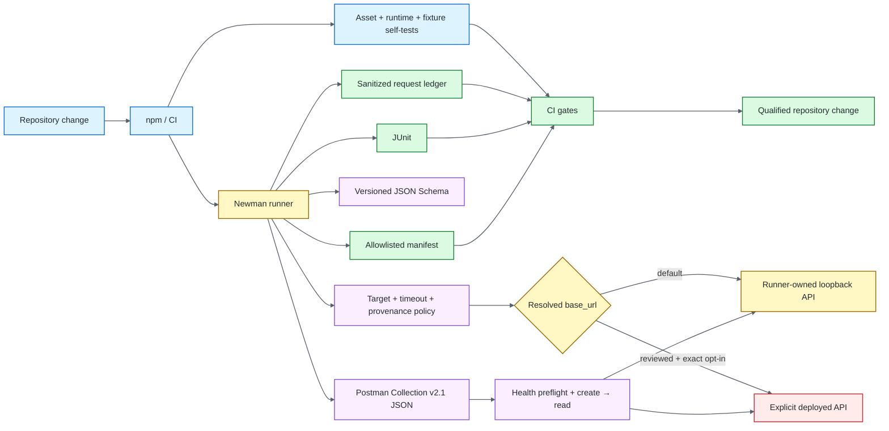

# Postman / Newman API Quality Engineering Framework

[](https://github.com/portyu9/qa-automation-api-postman-newman/actions/workflows/ci.yml)
[](https://github.com/portyu9/qa-automation-api-postman-newman/actions/workflows/extended.yml)
[](https://github.com/portyu9/qa-automation-api-postman-newman/actions/workflows/security.yml)
[](https://github.com/portyu9/qa-automation-api-postman-newman/actions/workflows/docs.yml)

[](https://nodejs.org/)
[](https://developer.mozilla.org/docs/Web/JavaScript)
[](https://www.postman.com/)
[](https://github.com/postmanlabs/newman)
[](https://github.com/features/actions)
[](https://trivy.dev/)
[](LICENSE)
[](.github/SECURITY.md)

A version-controlled API quality-engineering framework built around **Postman Collection v2.1 JSON** and the **Newman** execution engine. Postman assets own request/assertion semantics; the Node runner owns input provenance, deterministic target lifecycle, target authorization, schema injection, timeout/correlation policy, bounded evidence, and process-exit integrity.

> [!IMPORTANT]
> Required CI is repository-owned. The committed environment targets `http://127.0.0.1:4010`, and the runner starts/stops that protocol fixture itself. External execution is a separate reviewed integration choice and requires explicit authorization.

**Start here:** [capabilities](#capabilities) · [architecture](#architecture) · [quick start](#quick-start) · [external-target safety](#external-target-safety) · [repository map](#repository-map) · [documentation](#documentation)

## Capabilities

| Plane | Purpose | Primary evidence |
| --- | --- | --- |
| Runtime validation | Export integrity, path containment, target/timeouts, fixture/report policy | Node assertions + exit status |
| Primary collection | Request/assertion/schema/write semantics | JUnit + sanitized manifest |
| Stateful workflow | Health preflight and create→read state propagation | Collection assertions + request ledger |
| Data-driven contract | Iteration precedence across read/write cases | JUnit + manifest |
| Explicit integration | Same collection against a reviewed deployment | Target + authorization classification |
| Security | Source/advisory/dependency/configuration/secret/change-diff risk | CodeQL, npm Audit, Trivy, Dependency Review |
| Documentation | README/workflow/governance consistency | Documentation contract status |

## Architecture



Collection assets own **API semantics**; Node owns **execution governance**. The deeper target, lifecycle, evidence, and extension boundaries are documented in [`docs/ARCHITECTURE.md`](docs/ARCHITECTURE.md).

## Quick start

```bash
npm ci --ignore-scripts
npm run validate
npm test
```

No API process needs to be started manually for the deterministic default.

Useful focused execution:

```bash
npm run test:smoke
NEWMAN_ITERATION_DATA=data/posts.json npm test
```

For the complete runtime input table, variable precedence, evidence model, dependency policy, and failure triage, see [`docs/OPERATIONS.md`](docs/OPERATIONS.md).

## External-target safety

A non-local target requires **both** a reviewed override and an explicit exact authorization signal. A URL override by itself is rejected before Newman sends requests.

```bash
NEWMAN_BASE_URL=https://staging.example.test NEWMAN_ALLOW_EXTERNAL_TARGET=true npm test
```

`NEWMAN_ALLOW_EXTERNAL_TARGET` authorizes external traffic only when its value is the exact literal `true`; lookalikes such as `TRUE`, `1`, `yes`, whitespace-padded values, unset values, or `false` fail closed.

| Runtime input | Contract |
| --- | --- |
| `NEWMAN_BASE_URL` | Optional validated target override; non-local targets require separate authorization |
| `NEWMAN_ALLOW_EXTERNAL_TARGET` | Exact opt-in for reviewed non-local execution; only literal `true` authorizes it |

Authorized external runs are classified separately from deterministic framework-health runs, so deployed-environment failures are not confused with collection/runner regressions.

## Repository map

```text
.
├── .github/
├── collections/
├── data/
├── docs/
├── schemas/
└── scripts/
```

## Engineering contracts

- **Native ownership:** request and endpoint assertions stay in Postman assets rather than being duplicated in Node.
- **Deterministic default:** required CI targets the runner-owned loopback API, not a public dependency.
- **Fail-closed integration:** non-local traffic requires a separate exact authorization signal.
- **Reviewable inputs:** collection, environment, schema, and iteration-data files stay repository-contained.
- **Explicit state:** create→read workflow state uses temporary collection variables and is cleaned when the scenario completes.
- **Bounded evidence:** the request ledger and run manifest retain structural attribution, not broad raw runtime state.
- **Authoritative exits:** validation, authorization, fixture, Newman, assertion, evidence, and cleanup failures remain nonzero.

## Toolchain compatibility boundary

This repository intentionally remains a **Newman** framework using **Postman Collection v2.1 JSON**.

**Collection v3** uses **YAML** and belongs to a different Postman execution path. Newman does not execute Collection v3; **Postman CLI** is the migration path when Collection v3 or newer Postman-native Git behavior is required.

Changing collection format without changing and requalifying the runner would break the declared compatibility contract. Migration details live in [`docs/OPERATIONS.md`](docs/OPERATIONS.md#newman-and-collection-format-compatibility).

## Quality gates

| Gate | Responsibility |
| --- | --- |
| [`ci.yml`](.github/workflows/ci.yml) | Asset/runtime/fixture validation and primary Newman execution against deterministic loopback |
| [`extended.yml`](.github/workflows/extended.yml) | Data-driven breadth against the same deterministic target |
| [`security.yml`](.github/workflows/security.yml) | CodeQL, governed npm Audit, Trivy, and Dependency Review when available |
| [`docs.yml`](.github/workflows/docs.yml) | Links, badges, Mermaid, target-authorization docs, dependency-security docs, stable-gate consistency |

## Documentation

| Guide | Use it for |
| --- | --- |
| [`docs/ARCHITECTURE.md`](docs/ARCHITECTURE.md) | Runner/collection ownership, target policy, local lifecycle, evidence boundaries, extension rules |
| [`docs/TEST_STRATEGY.md`](docs/TEST_STRATEGY.md) | Assertion depth, focused/data-driven execution, external-environment policy, evidence and exit criteria |
| [`docs/OPERATIONS.md`](docs/OPERATIONS.md) | Commands, runtime inputs, variable precedence, evidence, compatibility, dependencies, triage |
| [`CONTRIBUTING.md`](CONTRIBUTING.md) | Change-quality expectations |

The deeper workflow and operational detail lives in `/docs`; the main README intentionally retains only the architecture overview above.

## Design principle

A strong Newman framework makes the failing boundary obvious: **asset/format compatibility, variable scope, runtime validation, target authorization, target preflight, local protocol/state fixture, collection assertion, request-evidence lifecycle, or explicit deployed environment**.
