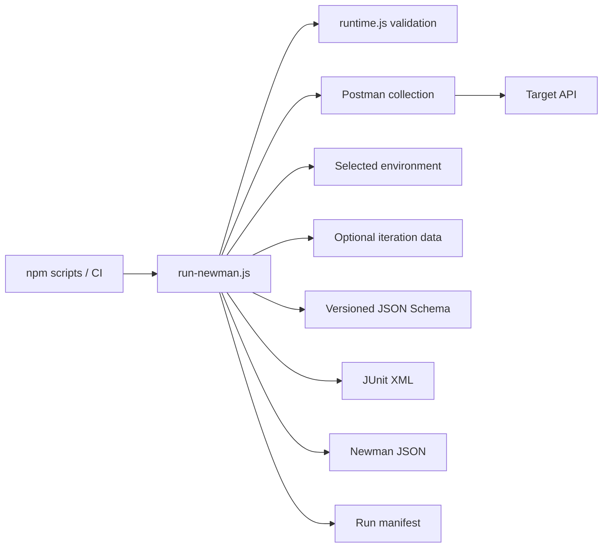
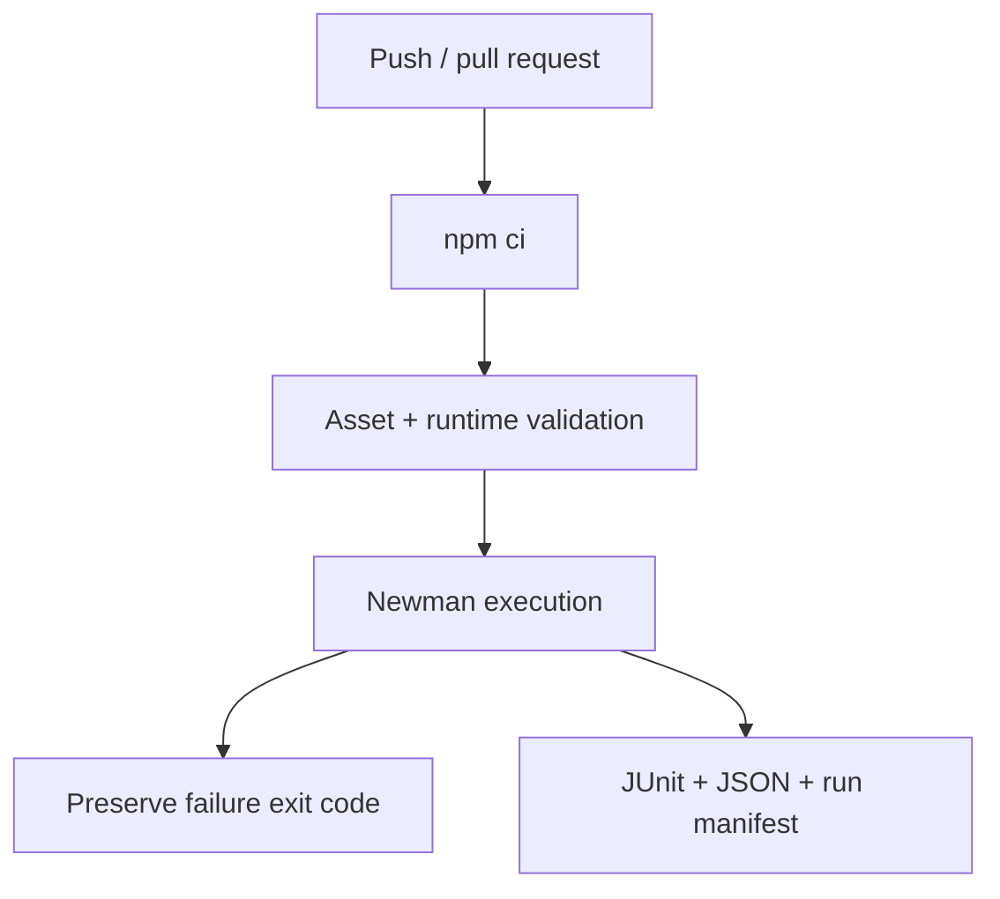

# Postman / Newman API Automation Framework

A version-controlled Postman/Newman framework for API behavior, JSON Schema validation, data-driven execution, environment promotion, request correlation, and machine-readable CI evidence. The Postman collection owns request/assertion semantics; the Node runner owns file provenance, runtime policy, reporting, and process exit behavior.

## Engineering contract

| Concern | Framework policy |
| --- | --- |
| Collection design | Shared protocol policies live at collection scope; endpoint-specific assertions stay with the endpoint. |
| Schemas | JSON Schemas are normal version-controlled files and are injected into Newman at runtime. |
| Environments | Committed environments contain non-secret defaults only; credentials are injected externally. |
| Runtime files | Collection, environment, and iteration-data overrides must resolve inside the repository root. |
| Timeouts | Request timeout is validated as a positive integer before Newman starts. |
| Correlation | One run ID and one request ID make CI failures traceable without embedding credentials. |
| Failure behavior | Newman assertion failures preserve a nonzero process exit code. |
| Evidence | JUnit, Newman JSON, and an atomic structured run manifest are written under `reports/`. |
| Reproducibility | Node 22+, pinned Newman 6.2.2, committed lockfile, and `npm ci` define the execution graph. |

## Architecture



The runner is intentionally thin around Newman. It adds execution governance without reimplementing Postman's request/assertion engine.

## Repository layout

```text
.
├── collections/
│   └── jsonplaceholder.postman_collection.json
├── schemas/
│   └── post-schema.json
├── data/
│   └── posts.json
├── scripts/
│   ├── run-newman.js
│   ├── runtime.js
│   ├── runtime.selftest.js
│   └── validate-assets.js
├── docs/
│   ├── ARCHITECTURE.md
│   └── TEST_STRATEGY.md
├── postman_environment.json
├── package.json
└── package-lock.json
```

## Quick start

Node.js 22+ is required.

```bash
npm ci
npm run validate
npm test
```

Run only the read-oriented folder:

```bash
npm run test:smoke
```

Run with iteration data:

```bash
NEWMAN_ITERATION_DATA=data/posts.json npm test
```

Select another committed environment:

```bash
NEWMAN_ENVIRONMENT=environments/staging.postman_environment.json npm test
```

`npm ci` is the normal install path. Use `npm install` only for deliberate dependency changes and review the lockfile diff before committing it.

## Commands

| Command | Purpose |
| --- | --- |
| `npm run validate` | Parse committed assets, check environment guardrails, and run deterministic runtime self-tests. |
| `npm test` | Execute the selected collection with CLI/JUnit/JSON reporters. |
| `npm run test:smoke` | Execute the `Read` folder only. |

## Runtime inputs

| Variable | Purpose | Default |
| --- | --- | --- |
| `NEWMAN_COLLECTION` | Collection path relative to repository root | `collections/jsonplaceholder.postman_collection.json` |
| `NEWMAN_ENVIRONMENT` | Environment path relative to repository root | `postman_environment.json` |
| `NEWMAN_ITERATION_DATA` | Optional iteration-data path | unset |
| `NEWMAN_FOLDER` | Optional Postman folder selection | unset |
| `REQUEST_TIMEOUT_MS` | Per-request Newman timeout | `10000` |
| `TEST_RUN_ID` | Run correlation identifier | generated timestamp-based ID |

The file variables are not arbitrary filesystem escape hatches. `scripts/runtime.js` resolves them against the repository root and rejects paths that traverse outside it. That keeps CI inputs reviewable and prevents an environment override from silently reading unrelated runner files.

## Collection variable model

| Variable | Scope | Purpose |
| --- | --- | --- |
| `base_url` | environment | Target service endpoint |
| `post_id` | environment / iteration | Read-case identifier |
| `user_id` | environment / iteration | Write-case input |
| `max_response_time_ms` | environment | Collection response-time budget |
| `run_id` | injected environment | Test-run correlation |
| `request_id` | local | Individual request correlation |
| `generated_title` | local | Unique write-case data |
| `post_schema` | injected global | Version-controlled schema text |

Prefer the narrowest variable scope. Request-local generated values should not become mutable environment state unless later requests intentionally consume them.

## Collection design

Collection-level scripts own only policies that genuinely apply to every request, such as:

- run/request correlation setup;
- maximum response-time policy;
- JSON content-type expectations where applicable.

Endpoint-level scripts own endpoint semantics:

- expected status;
- JSON shape/schema;
- requested identifier equality;
- generated payload echo/creation behavior;
- endpoint-specific negative conditions.

This prevents two failure modes: duplicated boilerplate across every request and oversized global scripts that make endpoint failures opaque.

## Schema strategy

`schemas/post-schema.json` is stored once in source control. The Node runner loads it and injects it as a Postman global for assertions.

Benefits:

- the schema receives normal code review;
- collection JSON does not contain a second embedded copy;
- schema changes have an isolated diff;
- the same artifact can be consumed by additional tooling later.

Schema validation is additive. A response can match a schema and still be semantically wrong, so tests also assert critical identifiers/values and protocol behavior.

## Runtime guardrails

`scripts/runtime.selftest.js` executes without network access and verifies:

- default and explicit timeout parsing;
- rejection of zero/invalid timeout budgets;
- correct resolution of repository-contained files;
- rejection of `../` path escape;
- stable compaction of Newman failure objects.

This is part of `npm run validate`, so framework runtime behavior is checked before the collection is sent to a remote API.

## Run manifest

After Newman completes, `scripts/run-newman.js` writes:

```text
reports/run-manifest.json
```

The manifest contains:

- schema version;
- run ID;
- exact collection/environment/iteration-data paths relative to the repository;
- selected folder and request timeout;
- Newman execution statistics;
- Newman timings;
- compact failure identities including parent, source, error type, bounded message, and location metadata.

The file is written to a temporary path first and atomically renamed. This prevents an interrupted process from leaving a partially written JSON artifact that appears valid by filename alone.

Generated evidence:

```text
reports/
├── newman-junit.xml
├── newman.json
└── run-manifest.json
```

JUnit is useful to CI test UIs, Newman JSON retains deep runner detail, and the run manifest provides a smaller stable operational summary.

## Secret handling

Do not commit:

- bearer/API tokens;
- passwords;
- session cookies;
- private keys;
- authorization header values;
- production credentials in exported Postman environments.

`validate-assets.js` checks committed environment content for obvious secret-like values, but that is a guardrail rather than a complete secret scanner. CI secret stores or environment-management systems should inject sensitive values at runtime.

## CI topology



CI uses the committed lockfile, lockfile-backed npm caching, read-only repository permissions, a bounded job timeout, and unconditional report upload when files exist.

## Failure triage

Use the artifact that best matches the failure class:

| Failure class | First evidence |
| --- | --- |
| Invalid JSON/export | `npm run validate` parser output |
| Suspicious committed environment value | asset-validation output |
| Runtime path escape | `runtime.js` validation error |
| Invalid timeout | runtime validation error |
| Request/connectivity failure | Newman CLI + `newman.json` |
| Assertion/schema failure | JUnit + compact run-manifest failure identity |
| Data iteration mismatch | run-manifest input provenance + Newman JSON |
| Unexpected zero tests | Newman stats + selected folder/path inputs |

Do not suppress Newman failures with shell constructs such as `|| true`. A report artifact is useful only if the job outcome still represents the test result.

## Extension rules

When adding requests or environments:

- keep shared collection scripts small and policy-focused;
- keep endpoint assertions close to the request;
- store reusable schemas in `schemas/` rather than embedding duplicates;
- add iteration files under a reviewed repository directory;
- add runtime validation for new Node-side inputs;
- preserve relative input provenance in the run manifest;
- inject secrets at execution time;
- keep Newman as the source of request/assertion semantics rather than reproducing collection logic in Node.

## Anti-patterns

The framework intentionally avoids:

- collection/environment paths outside the repository;
- secrets committed in Postman exports;
- duplicated schema text inside collection scripts;
- assertion failures converted to zero exit status;
- one giant collection-level script containing endpoint-specific business rules;
- status-code-only tests with no semantic assertions;
- machine-readable reports without input provenance;
- `npm install` in CI with a mutable dependency graph.

## Further design documentation

- [`docs/ARCHITECTURE.md`](docs/ARCHITECTURE.md) — collection, runner, schema, environment, and reporting boundaries.
- [`docs/TEST_STRATEGY.md`](docs/TEST_STRATEGY.md) — API assertion depth, data-driven execution, environment promotion, and gate policy.

The framework should keep the Postman assets **portable**, the execution inputs **reviewable**, and a failed Newman run **attributable** without turning the Node runner into a second API test framework.
