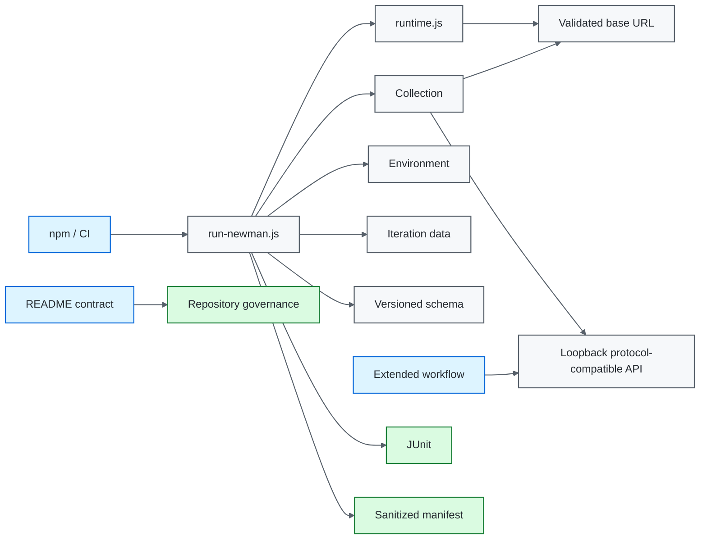
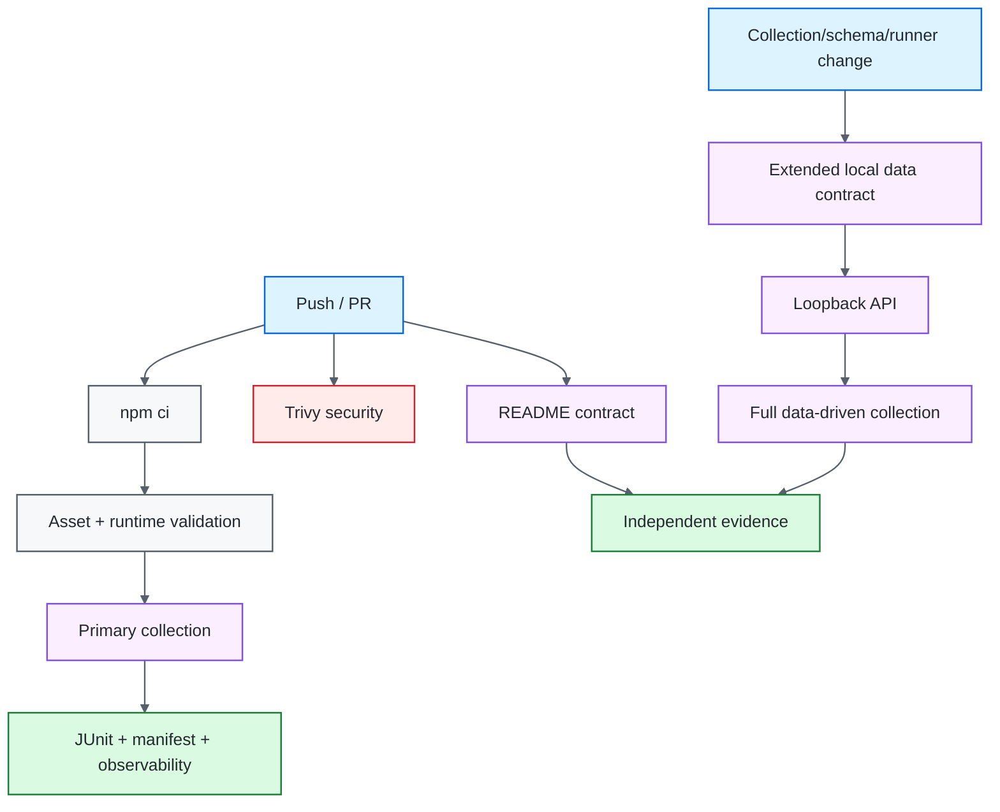

# Postman / Newman API Quality Engineering Framework

[](https://github.com/portyu9/qa-automation-api-postman-newman/actions/workflows/ci.yml)
[](https://github.com/portyu9/qa-automation-api-postman-newman/actions/workflows/extended.yml)
[](https://github.com/portyu9/qa-automation-api-postman-newman/actions/workflows/security.yml)
[](https://github.com/portyu9/qa-automation-api-postman-newman/actions/workflows/docs.yml)

[](https://nodejs.org/)
[](https://developer.mozilla.org/docs/Web/JavaScript)
[](https://www.postman.com/)
[](https://github.com/postmanlabs/newman)
[](https://github.com/features/actions)
[](https://trivy.dev/)
[](LICENSE)
[](.github/SECURITY.md)

A version-controlled API quality-engineering framework built around Postman collections and the Newman execution engine. The collection owns request and assertion semantics; the Node runner owns validated input provenance, target policy, timeout policy, schema injection, correlation, reporting, and process-exit integrity. A deterministic loopback API provides a broader data-driven validation path without making extended CI dependent on a public service.

> [!IMPORTANT]
> Postman assets remain the source of API-test intent. The Node layer governs execution; it does not reimplement collection assertions. That boundary keeps the collection portable while making CI inputs, evidence, and safety policy explicit and reviewable.

## Capability map

| Plane | What it proves | Target model | Evidence |
| --- | --- | --- | --- |
| Primary CI | Collection semantics against configured API | Reviewed HTTP(S) target | JUnit + sanitized run manifest |
| Asset/runtime validation | Export integrity, path containment, URL/timeouts, reporter policy | No request required for self-tests | Node validation output |
| Extended data contract | Full collection + iteration data + request/write semantics | Deterministic `127.0.0.1` API | JUnit, manifest, local API log |
| Security | Dependency/configuration exposure | Repository filesystem | Trivy JSON + Markdown summary |
| Documentation contract | README links, workflow badges, Mermaid declarations, governance surfaces, badge palette | Repository-local Python stdlib validation | Actions status |
| Observability | Execution identity and gate state | Structured run envelope | `reports/ci-observability.json`, Actions summary |



## Engineering invariants

| Concern | Framework contract |
| --- | --- |
| Collection ownership | Shared protocol policy lives at collection scope; endpoint semantics stay with each request. |
| Runtime files | Collection/environment/data overrides must resolve inside the repository root. |
| Target policy | Resolved `base_url` must be absolute HTTP(S), with no URL credentials, query, or fragment. |
| Schemas | Reusable JSON Schemas are normal version-controlled files, injected at runtime. |
| Variable precedence | Iteration data intentionally overrides environment values for data-driven `post_id` / `user_id` expectations. |
| Secrets | Committed environments contain non-secret defaults only; credentials are injected through controlled runtime channels. |
| Correlation | Run and request IDs identify execution without becoming payload/credential carriers. |
| Exit integrity | Newman assertion/runtime failures preserve a nonzero process result; reporters and cleanup cannot convert failure to success. |
| Evidence | JUnit plus a narrow allowlisted manifest; raw Newman JSON is not retained by default. |
| Reproducibility | Node 22+, Newman `6.2.2`, committed lockfile, `npm ci`. |
| Documentation | README-local references, workflow badges, Mermaid roots, governance files, and static badge-color uniqueness are executable contracts. |

## Tool ownership model

| Tool / technology | Native responsibility | Framework responsibility | Deliberately left visible |
| --- | --- | --- | --- |
| Postman Collection v2.1 | Request definitions, folders, pre-request/test scripts, variable references, portable API-test intent | Keep shared policy at collection scope and endpoint semantics adjacent to each request | `pm.*` assertion/runtime semantics remain the contract language |
| Newman | Execute the collection, honor Postman runtime semantics, select folders/data, emit reporter results and process status | Validate all execution inputs before launch, inject schemas/correlation/target, preserve exit status, produce bounded evidence | Newman failures/statistics remain authoritative; the wrapper is not a second assertion engine |
| Postman variable scopes | Environment, iteration data, local/collection/global lookup semantics | Use narrow scope intentionally; iteration data wins where a data-driven case supplies identifiers | Variable-precedence behavior is explicit in collection assertions rather than hidden in Node preprocessing |
| JSON Schema assertions | Structural response validation through Postman runtime | Store reusable schema once under `schemas/` and inject its text | Schema success does not replace semantic assertions such as requested ID or echoed write data |
| Node runtime | Filesystem/process/HTTP primitives | Repository-root path containment, local API fixture, timeout parsing, atomic manifest writing | Node policy failures occur before Newman rather than appearing as API assertion failures |
| Local protocol fixture | Built-in Node HTTP listener semantics | Deterministic read/write/health/request-ID contract on loopback | It is a test dependency, not a production-service emulator |
| JUnit reporter | CI-compatible assertion representation | Retain focused JUnit evidence alongside the allowlisted manifest | Reporter output cannot override Newman process status |
| Trivy | Filesystem vulnerability and supported misconfiguration analysis | HIGH/CRITICAL remediation-oriented gate and retained findings | Configured `vuln,misconfig` scan is not generic credential/secret scanning |
| GitHub Actions | Job scheduling, environment isolation, artifacts | Primary/local-extended/security/docs separation and observability envelope | Native job/process exit status remains authoritative |

## Repository map

```text
.
├── collections/jsonplaceholder.postman_collection.json
├── schemas/post-schema.json
├── data/posts.json
├── scripts/
│   ├── run-newman.js
│   ├── runtime.js
│   ├── runtime.selftest.js
│   ├── validate-assets.js
│   └── local-api.js
├── docs/
│   ├── ARCHITECTURE.md
│   └── TEST_STRATEGY.md
├── .github/
│   ├── scripts/
│   │   └── validate_readme.py
│   └── workflows/
│       ├── ci.yml
│       ├── docs.yml
│       ├── extended.yml
│       └── security.yml
├── postman_environment.json
├── package.json
└── package-lock.json
```

## Documentation contract

`.github/workflows/docs.yml` validates deterministic repository-local documentation facts on every pull request and `main`: local Markdown targets, committed workflow badge targets, Mermaid declarations, root `LICENSE`, `.github/SECURITY.md`, unique static Shields colors, and the GitHub-dark `#24292F` Security Policy badge. External website uptime is deliberately outside this contract.

The badge palette preserves family identity without duplicating colors: Postman retains official `#FF6C37`; Newman uses darker Postman-family `#C84A22` rather than an unrelated brand color.

## Quick start

Node.js 22+ is required.

```bash
npm ci
npm run validate
npm test
python .github/scripts/validate_readme.py
```

Read-only smoke folder:

```bash
npm run test:smoke
```

Data-driven execution:

```bash
NEWMAN_ITERATION_DATA=data/posts.json npm test
```

Reviewed target override:

```bash
NEWMAN_BASE_URL=https://staging.example.test npm test
```

> [!NOTE]
> `npm ci` is the execution path. Dependency changes should be made deliberately with `npm install`, reviewed through the manifest/lockfile diff, and then validated by CI.

<details>
<summary><strong>Runtime input reference</strong></summary>

| Variable | Purpose | Default |
| --- | --- | --- |
| `NEWMAN_COLLECTION` | Collection path inside repository | `collections/jsonplaceholder.postman_collection.json` |
| `NEWMAN_ENVIRONMENT` | Environment path inside repository | `postman_environment.json` |
| `NEWMAN_ITERATION_DATA` | Optional iteration-data path | unset |
| `NEWMAN_FOLDER` | Optional Postman folder selector | unset |
| `NEWMAN_BASE_URL` | Validated target override | environment `base_url` |
| `REQUEST_TIMEOUT_MS` | Per-request timeout | `10000` |
| `TEST_RUN_ID` | Run correlation | generated ID |

Paths are execution inputs, not arbitrary filesystem escape hatches. `runtime.js` resolves them relative to the repository root and rejects traversal outside it.

</details>

## Collection architecture

Collection-level scripts own cross-request policy only:

- run/request correlation;
- response-time budget;
- common JSON content-type expectations.

Endpoint scripts own endpoint semantics:

- status;
- schema;
- requested identifier equality;
- write representation/echo behavior;
- endpoint-specific negative conditions.

This avoids two common extremes: duplicated protocol boilerplate in every request, and a giant global script that hides which endpoint contract actually failed.

## Variable scope and precedence

| Variable | Scope | Purpose |
| --- | --- | --- |
| `base_url` | environment | Validated service target |
| `post_id` | environment / iteration | Read identifier; iteration value wins when supplied |
| `user_id` | environment / iteration | Write input; iteration value wins when supplied |
| `max_response_time_ms` | environment | Shared response-time budget |
| `run_id` | injected environment | Run correlation |
| `request_id` | local | Individual request correlation |
| `generated_title` | local | Unique write-case value |
| `post_schema` | injected global | Version-controlled schema text |

Use the narrowest scope that expresses data lifetime. Generated request-local values should not become mutable environment state unless a later request intentionally consumes them. Data-driven assertions explicitly consult `pm.iterationData` before environment fallback so the assertion evaluates the same identifier/input that drove the request.

## Schema strategy

`schemas/post-schema.json` is stored once and injected into Newman at runtime. This keeps schema changes reviewable and reusable without duplicating schema blobs inside collection scripts.

Schema correctness is necessary but not sufficient. A structurally valid response can still return the wrong record or wrong semantic values, so request tests assert both shape and key semantics.

## Execution governance

`scripts/runtime.selftest.js` validates Node-side policy without contacting a target:

- default/explicit timeout parsing;
- invalid/non-positive timeout rejection;
- repository-contained file resolution;
- path traversal rejection;
- HTTP(S) target validation;
- rejection of URL credentials/query/fragment;
- diagnostic URL sanitization;
- bounded compact failure mapping.

`scripts/validate-assets.js` checks committed collection/environment assets before Newman starts. `scripts/local-api.js` is syntax-checked as part of the same validation command.

## Deterministic extended data contract

`extended.yml` executes the full data-driven collection against `scripts/local-api.js`, a small protocol-compatible loopback service implemented with Node's built-in HTTP module.

The service supports the exact contract exercised by the collection:

- `GET /health` for bounded readiness;
- `GET /posts`;
- `GET /posts/:id`;
- `POST /posts` with deterministic creation representation;
- JSON content type and request-ID echo.

Execution flow:

```text
start local-api.js on 127.0.0.1:4010
        ↓
bounded readiness polling
        ↓
NEWMAN_BASE_URL=http://127.0.0.1:4010
NEWMAN_ITERATION_DATA=data/posts.json
        ↓
full Newman collection
        ↓
JUnit + sanitized manifest + local API log
```

This validates collection scripts, variable precedence, iteration data, schema injection, runner governance, reporting, read/write semantics, and the real local HTTP path while eliminating public-service drift from the extended gate.

## Run manifest and exit semantics

After execution, `scripts/run-newman.js` writes:

```text
reports/
├── newman-junit.xml
└── run-manifest.json
```

The manifest records schema/run identity, relative collection/environment/data provenance, selected folder, sanitized validated base URL, request timeout, Newman stats/timings, and compact bounded/redacted failure identity. It is written atomically via a temporary file.

Raw Newman JSON is not a default artifact because third-party runtime objects can contain substantially more context than the operational contract needs. The runner instead constructs a narrow allowlist. More evidence is not automatically safer evidence.

Most importantly, manifest/report generation is **secondary** to Newman's exit result. Assertion or runtime failure must remain nonzero. `|| true`, swallowed callback errors, or cleanup/reporting wrappers that turn a failing collection green violate the framework contract.

## Security engineering

`.github/workflows/security.yml` runs the open-source Trivy filesystem scanner. The action is pinned to immutable commit `ed142fd0673e97e23eac54620cfb913e5ce36c25` (`v0.36.0`) and installs Trivy `v0.74.0`.

The gate focuses on configured fixed HIGH/CRITICAL dependency vulnerabilities and HIGH/CRITICAL supported repository/configuration misconfigurations. Evidence is retained as JSON plus a Markdown count summary. Its configured scanners are `vuln,misconfig`; the repository does not claim that workflow as generic credential/secret scanning.

Collection/export validation remains complementary: Trivy does not replace the framework's own target/path/runtime validation.

## Observability model

Primary CI produces:

```text
reports/
├── newman-junit.xml
├── run-manifest.json
├── ci-observability.json
└── ci-summary.md
```

`ci-observability.json` supplies a small stable run-level index: framework, run ID, runtime dimension, final job state, SHA, and ref. The Newman manifest supplies API-execution provenance/statistics; JUnit supplies assertion integration.

```text
GitHub Actions run
└── TEST_RUN_ID
    ├── collection/environment/data provenance
    ├── per-request request_id values
    ├── Newman stats/failures
    └── CI observability envelope
```

No proprietary analytics backend is required; the JSON artifacts can be ingested later by open-source log/telemetry tooling.

## CI topology



## Failure triage

| Signal | First boundary | First evidence |
| --- | --- | --- |
| Invalid export/JSON | Asset integrity | `npm run validate` |
| Path escape | Runtime governance | `runtime.js` validation |
| Invalid target URL | Target policy | pre-Newman validation error |
| Invalid timeout | Runtime policy | pre-Newman validation error |
| Request/connectivity | HTTP dependency | Newman CLI + JUnit |
| Schema/assertion | API contract | JUnit + compact manifest failure |
| Data iteration mismatch | Variable/input provenance | manifest + dataset + endpoint assertion |
| Local extended failure | Collection/runner/local protocol path | local API log + manifest |
| Unexpected zero tests | Selection/provenance | Newman stats + folder/path inputs |
| README contract | Documentation/governance drift | Validator output |
| Trivy failure | Dependency/configuration risk | `trivy.json` |

## Extension rules

1. keep shared collection scripts small and policy-focused;
2. keep endpoint semantics adjacent to each request;
3. store reusable schemas under `schemas/`;
4. keep data files reviewed and repository-contained;
5. validate every new Node-side execution input;
6. make variable precedence explicit when environment and iteration scopes can both provide a value;
7. preserve target and input provenance in evidence;
8. inject credentials through controlled runtime mechanisms rather than URLs;
9. preserve Newman as the request/assertion engine and its process status as authoritative;
10. prefer deterministic local protocol fixtures for broader CI scenarios;
11. keep raw retained evidence intentionally narrow;
12. update README contracts when public inputs, workflows, collection responsibilities, or evidence surfaces change.

## Explicit anti-patterns

- collection/environment/data paths outside the repository;
- URL credentials/query secrets/fragments;
- committed environment credentials;
- ambiguous iteration/environment precedence;
- raw Newman summaries retained without a data contract;
- duplicated schema blobs inside scripts;
- assertion failures converted to zero exit status;
- endpoint-specific logic hidden in one giant collection hook;
- status-only assertions;
- reports without input provenance;
- `npm install` in CI;
- README claims or badge surfaces not backed by committed repository state.

## Design references

- [`docs/ARCHITECTURE.md`](docs/ARCHITECTURE.md) — collection, runner, schema, target, and evidence boundaries.
- [`docs/TEST_STRATEGY.md`](docs/TEST_STRATEGY.md) — assertion depth, data-driven execution, environment promotion, and gates.

> [!TIP]
> The goal is portable Postman intent with governed Newman execution. The runner should make a collection easier to operate safely and diagnose precisely—not become a second API testing language beside it.
