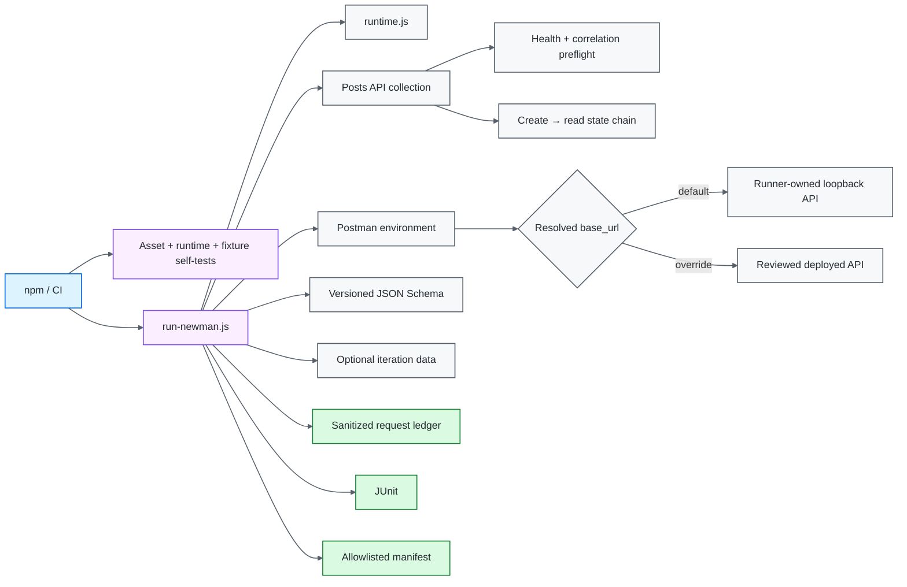

# Postman / Newman API Quality Engineering Framework

[](https://github.com/portyu9/qa-automation-api-postman-newman/actions/workflows/ci.yml)
[](https://github.com/portyu9/qa-automation-api-postman-newman/actions/workflows/extended.yml)
[](https://github.com/portyu9/qa-automation-api-postman-newman/actions/workflows/security.yml)
[](https://github.com/portyu9/qa-automation-api-postman-newman/actions/workflows/docs.yml)

[](https://nodejs.org/)
[](https://developer.mozilla.org/docs/Web/JavaScript)
[](https://www.postman.com/)
[](https://github.com/postmanlabs/newman)
[](https://github.com/features/actions)
[](https://trivy.dev/)
[](LICENSE)
[](.github/SECURITY.md)

A version-controlled API quality-engineering framework built around **Postman Collection v2.1** and the **Newman** execution engine. Postman assets own request/assertion semantics; the Node runner owns input provenance, deterministic target lifecycle, schema injection, timeout policy, correlation, bounded request-event evidence, and process-exit integrity.

> [!IMPORTANT]
> Required execution is repository-owned. The committed environment points to `http://127.0.0.1:4010`, and the runner starts/stops that protocol fixture itself. A deployed API is an explicit `NEWMAN_BASE_URL` integration choice—not a dependency of the framework's health.

**Read by intent:** [capabilities](#capability-map) · [architecture](#architecture) · [quick start](#quick-start) · [collection design](#collection-architecture) · [stateful workflow](#preflight-and-stateful-workflow) · [variable precedence](#variable-scope-and-precedence) · [evidence](#run-manifest-execution-ledger-and-exit-integrity) · [compatibility](#newman-and-collection-format-compatibility) · [dependencies](#dependency-maintenance) · [triage](#failure-triage)

## Capability map

| Plane | What it proves | Target model | Evidence |
| --- | --- | --- | --- |
| Runtime validation | Export integrity, path containment, target/timeouts, fixture/report policy | No external dependency | Node assertions + exit status |
| Primary collection | Request/assertion/schema/write semantics | Runner-owned loopback API | JUnit + sanitized manifest |
| Preflight + stateful workflow | Target readiness/correlation and create→read state propagation | Same isolated local API | Collection assertions + ledger |
| Data-driven contract | Iteration precedence across read/write cases | Same local API | JUnit + manifest |
| Execution ledger | Request ordering/method/path/status/timing/transport class | Newman request events | Bounded allowlisted records |
| Explicit integration | Same collection against a reviewed deployment | Explicit HTTP(S) override | External target classification |
| Security | Source/dependency/configuration exposure | CodeQL + Trivy + Dependency Review when available | SAST + repository scan + dependency-diff evidence |
| Documentation | README/workflow/governance consistency | Repository-local validator | Actions status |

## Architecture



## Engineering invariants

| Concern | Framework contract |
| --- | --- |
| Collection ownership | Request definitions/assertions stay in Postman assets, not duplicated in Node. |
| Collection identity | `collections/posts-api.postman_collection.json` is provider-neutral and describes the behavior under test. |
| Collection format | v2.1 JSON is deliberate because Newman executes v2.1 collections; format/runtime migration is an explicit toolchain change. |
| Default target | Committed `base_url` is `http://127.0.0.1:4010`. |
| Target lifecycle | Runner starts/stops the local API only for the deterministic default. |
| Local state | The fixture owns isolated in-memory created resources for the run and exposes deterministic create→read semantics. |
| External integration | Non-default `NEWMAN_BASE_URL` is explicit and classified separately. |
| Runtime files | Collection/environment/data overrides must resolve inside repository root. |
| Target policy | Absolute HTTP(S); no URL credentials, query, or fragment. |
| Schemas | Reusable JSON Schemas are version-controlled and injected once. |
| Variable precedence | Iteration data deliberately overrides environment values where supplied. |
| Chained state | Collection variables are used only for intentionally cross-request state and are removed when their scenario completes. |
| Correlation | Run/request IDs identify execution without becoming payload/credential carriers. |
| Exit integrity | Validation, Newman, assertion, fixture, manifest, and cleanup failures remain nonzero. |
| Evidence | Retain focused JUnit + allowlisted manifest/ledger, not raw runtime state by default. |

## Boundary decision guide

| Requirement | Owner |
| --- | --- |
| Request and endpoint assertion semantics | Postman collection |
| Reusable structural schema | `schemas/` |
| Environment/iteration data | Postman/Newman variable scopes |
| Cross-request scenario state | Collection variables with explicit cleanup |
| File path/URL/timeout policy | Node runner/runtime |
| Deterministic HTTP protocol behavior | Local Node fixture |
| CI-compatible test evidence | Newman JUnit reporter |
| Bounded request observations | Execution ledger |
| Broader runtime metadata | Sanitized run manifest |

> [!TIP]
> Keep policy in the narrowest place that owns it. If an assertion is meaningful inside Postman, duplicating it in the Node launcher creates two sources of truth rather than more confidence.

## Repository map

```text
.
├── .github/
│   ├── scripts/
│   └── workflows/
├── collections/
├── data/
├── docs/
├── schemas/
└── scripts/
```

## Quick start

CI qualifies Node.js 22 and 24 with npm 11.19.1. Other Node major lines are outside the declared support contract.

```bash
npm ci --ignore-scripts
npm run validate
npm test
```

No API process needs to be started manually for the default configuration.

```bash
# read-only smoke folder
npm run test:smoke

# data-driven full collection
NEWMAN_ITERATION_DATA=data/posts.json npm test

# explicit deployed API
NEWMAN_BASE_URL=https://staging.example.test npm test
```

<details>
<summary><strong>Runtime input reference</strong></summary>

| Variable | Purpose | Default |
| --- | --- | --- |
| `NEWMAN_COLLECTION` | Collection path inside repository | `collections/posts-api.postman_collection.json` |
| `NEWMAN_ENVIRONMENT` | Environment path | `postman_environment.json` |
| `NEWMAN_ITERATION_DATA` | Optional iteration data | unset |
| `NEWMAN_FOLDER` | Optional exact folder selector | unset |
| `NEWMAN_BASE_URL` | Explicit target override | environment `base_url` |
| `REQUEST_TIMEOUT_MS` | Per-request timeout | `10000` |
| `TEST_RUN_ID` | Run correlation | generated ID |

</details>

## Deterministic target lifecycle

`scripts/local-api.js` implements exactly the protocol surface the collection requires: `GET /health`, `GET /posts`, `GET /posts/:id`, `POST /posts`, JSON content type, request-ID echo, deterministic create representation, isolated created-state lookup, and explicit error responses.

When the resolved target equals the local default, `scripts/run-newman.js` starts the fixture, executes Newman, writes the sanitized manifest, and closes the fixture in `finally`. Startup/cleanup failures remain nonzero.

A non-default safe HTTP(S) target disables the local fixture and becomes an explicit integration run.

## Collection architecture

Collection-level scripts own cross-request policy: run/request correlation, response-time budget, and JSON content-type expectation. Endpoint scripts own endpoint semantics: status, schema, identifier equality, write representation, readiness, and state handoff.

The runner does **not** reimplement those assertions. That keeps the collection portable across Postman/Newman while CI/runtime policy remains explicit in code.

## Preflight and stateful workflow

The collection includes two intentionally different forms of sequencing:

1. **Runtime preflight** — `GET /health` verifies readiness, response semantics, and request-ID echo before behavior-dependent requests run.
2. **Create → read contract** — the write request stores the created ID/title as collection variables; the next request reads that resource, validates schema/identity/title, then removes those temporary collection variables.

This is not hidden test ordering. The dependency is explicit inside one collection workflow, the local API isolates created state to the owned fixture process, and temporary cross-request variables are cleaned after use.

Read-only smoke execution selects its folder exactly rather than relying on substring matching, keeping intent stable as collection names evolve.

## Variable scope and precedence

| Variable | Scope | Purpose |
| --- | --- | --- |
| `base_url` | environment | Validated service target |
| `post_id` | environment / iteration | Read identifier; iteration wins |
| `user_id` | environment / iteration | Write input; iteration wins |
| `max_response_time_ms` | environment | Shared response-time budget |
| `run_id` | injected environment | Run correlation |
| `request_id` | local | Per-request correlation |
| `generated_title` | local | Unique write value |
| `created_post_id` / `created_post_title` | collection, temporary | Explicit create→read handoff; unset after use |
| `post_schema` | injected global | Version-controlled schema text |

Use the narrowest variable scope that matches lifetime. Request-local generated values should not silently become mutable shared environment state.

## Execution governance

`npm run validate` proves policy before collection execution: committed JSON integrity, secret-like environment guards, path containment, timeout parsing, target validation, URL sanitization, bounded failure compaction, execution-ledger sanitization, and executable local-fixture behavior.

A launcher or fixture defect should therefore be reproducible without a public service.

## Run manifest, execution ledger, and exit integrity

The runner writes `reports/newman-junit.xml` and `reports/run-manifest.json`. The manifest contains allowlisted inputs, target class, timeout, stats/timings, sanitized executions, and bounded/redacted failures. It is written atomically. Required CI independently rejects missing/empty JUnit, zero request/assertion counts, empty/mismatched execution-ledger evidence, transport errors, invalid HTTP status evidence, and manifest failures before artifacts are accepted.

`ExecutionLedger` subscribes to Newman's `request` events and keeps a bounded record of:

- iteration and request position when available;
- normalized HTTP method;
- URL **pathname only**—query strings and raw URLs are discarded;
- integer status code;
- non-negative response time;
- transport error class, not arbitrary error payload text.

The ledger is a bounded rolling window: when it reaches its configured maximum, the oldest observation is evicted before the newest one is retained. Snapshots copy retained entries so consumers do not receive the mutable internal array.

Raw Newman JSON is intentionally not retained by default because broad runtime serialization can expose substantially more context than CI needs.

Evidence generation never converts a failing execution to success. Validation, fixture startup, Newman runtime, assertions, manifest creation, and cleanup preserve nonzero status.

## Newman and collection-format compatibility

This repository intentionally remains a **Newman** framework, so its committed collection uses Postman Collection **v2.1 JSON**.

Postman v12 introduced Collection v3 for Native Git workflows, and Newman does not execute v3 collections. Postman recommends its Postman CLI for v3/new Native Git workflows. Treat any future migration as an explicit runtime/format/CI decision: migrate the collection, reproduce the existing deterministic target/evidence/exit contracts, and validate behavior before retiring Newman. Do not silently convert the collection format while keeping a Newman runner that cannot execute it.

For an existing Newman-focused framework, v2.1 is therefore a compatibility contract, not technical debt by itself.

## CI and security

Primary CI runs the default collection against the runner-owned fixture. Extended CI adds iteration-data breadth against the **same** deterministic fixture. The difference is coverage breadth, not target reliability.

Security and docs workflows remain independent failure domains. CodeQL covers source-level security analysis; Trivy covers repository dependency/configuration/secret findings; pull requests use Dependency Review when GitHub Dependency graph is available and record an explicit fallback otherwise. These findings are not collection flakiness.

## Dependency maintenance

Dependabot maintains **npm** and **GitHub Actions**.

- weekly Monday 09:00 America/New_York;
- grouped minor/patch updates reduce routine PR noise;
- major Newman/Node ecosystem upgrades remain standalone;
- GitHub Actions are treated as executable dependencies;
- dependency PRs are evaluated by asset validation, runtime/fixture/ledger self-tests, Newman execution, security, and docs workflows.

Dependabot, npm 11.19.1, lifecycle-script-disabled locked installation, deterministic fixture tests, CodeQL, Trivy, and Dependency Review address different supply-chain risks and should remain separate controls.

## Failure triage

| Signal | First interpretation |
| --- | --- |
| Asset validation | Export/configuration policy |
| Runtime self-test | Path/URL/timeout/evidence policy |
| Fixture self-test | Local protocol/state fixture defect |
| Ledger self-test | Request-event sanitization/bounding policy |
| Health preflight | Target readiness/correlation contract |
| Local fixture startup | Listener/port lifecycle |
| Newman runtime | Postman runtime/transport |
| Endpoint assertion/schema | API behavior contract |
| Create→read mismatch | Explicit chained-state contract |
| Iteration mismatch | Variable/data precedence |
| External-target-only failure | Deployment/environment integration |
| Security/docs | Independent repository governance |

## Explicit anti-patterns

- required CI against a public API;
- provider-specific names for provider-neutral local contracts;
- converting to Collection v3 while retaining a Newman runner;
- duplicated assertions in Node and Postman;
- repository path overrides that escape the project root;
- raw runtime evidence retained without a data-minimization reason;
- query strings, auth material, cookies, or arbitrary payloads in the generic request ledger;
- mutable environment state used for request-local values;
- cross-request collection state left behind after its scenario;
- reports that swallow Newman/fixture failures;
- external target availability used to define framework health.

## Design references

- [`docs/ARCHITECTURE.md`](docs/ARCHITECTURE.md) — runner, fixture, assets, target policy, and evidence boundaries.
- [`docs/TEST_STRATEGY.md`](docs/TEST_STRATEGY.md) — request/assertion ownership, data-driven execution, and exit criteria.
- [`CONTRIBUTING.md`](CONTRIBUTING.md) — change-quality expectations.

A strong Newman framework makes the failing boundary obvious: **asset/format compatibility, variable scope, runtime validation, target preflight, local protocol/state fixture, collection assertion, request evidence lifecycle, or explicit deployed environment**.
