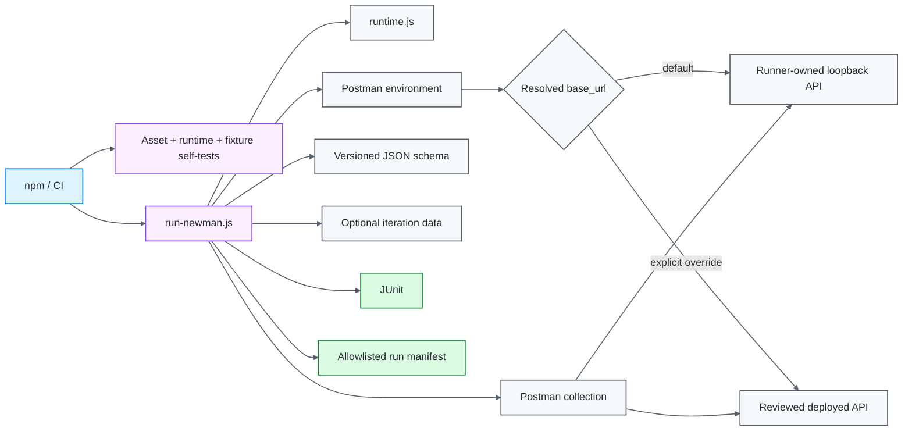
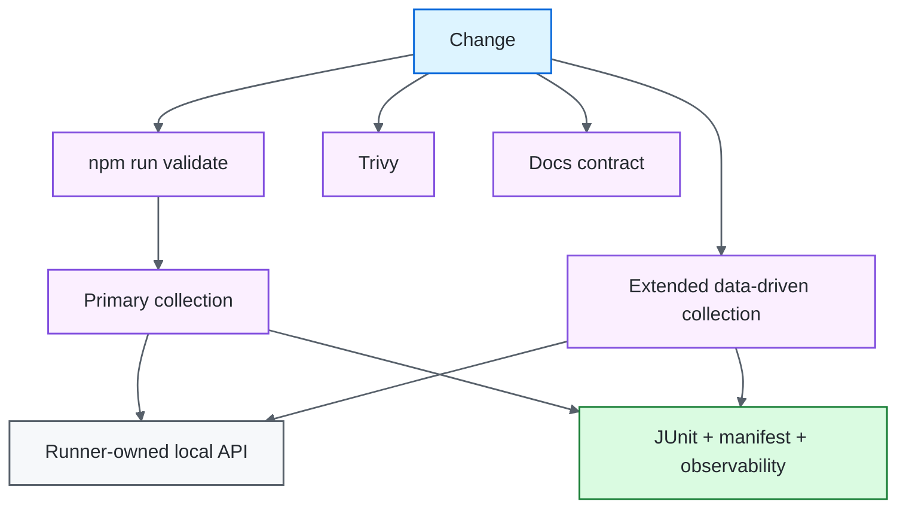

# Postman / Newman API Quality Engineering Framework

[](https://github.com/portyu9/qa-automation-api-postman-newman/actions/workflows/ci.yml)
[](https://github.com/portyu9/qa-automation-api-postman-newman/actions/workflows/extended.yml)
[](https://github.com/portyu9/qa-automation-api-postman-newman/actions/workflows/security.yml)
[](https://github.com/portyu9/qa-automation-api-postman-newman/actions/workflows/docs.yml)

[](https://nodejs.org/)
[](https://developer.mozilla.org/docs/Web/JavaScript)
[](https://www.postman.com/)
[](https://github.com/postmanlabs/newman)
[](https://github.com/features/actions)
[](https://trivy.dev/)
[](LICENSE)
[](.github/SECURITY.md)

A version-controlled API quality-engineering framework built around **Postman Collection v2.1** and the **Newman** execution engine. Postman assets own request and assertion semantics; the Node runner owns validated input provenance, deterministic target lifecycle, schema injection, timeout policy, run/request correlation, evidence construction, and process-exit integrity.

> [!IMPORTANT]
> Required execution does not depend on a public API. The committed environment targets `http://127.0.0.1:4010`, and `scripts/run-newman.js` starts and stops the repository-owned protocol fixture when that default target is selected. A deployed API remains available through an explicit `NEWMAN_BASE_URL` override.

## Capability map

| Plane | What it proves | Target model | Evidence |
| --- | --- | --- | --- |
| Asset/runtime validation | Export integrity, path containment, target/timeouts, fixture protocol, reporter policy | No external dependency | Node assertions + process status |
| Primary collection | Request/assertion/schema/write semantics | Runner-owned loopback API | JUnit + sanitized run manifest |
| Data-driven contract | Iteration precedence across read/write cases | Same runner-owned loopback API | JUnit + manifest |
| Explicit integration | Same collection against a reviewed deployment | Explicit HTTP(S) override | JUnit + manifest with external target classification |
| Security | Dependency/configuration exposure | Repository filesystem | Trivy JSON + Markdown summary |
| Documentation | README/workflow/governance consistency | Repository-local validator | Actions status |
| Observability | Run identity, target class, final gate state | Structured execution envelope | `reports/` + Actions summary |



## Engineering invariants

| Concern | Framework contract |
| --- | --- |
| Collection ownership | Request definitions and assertions remain in Postman assets, not duplicated in Node code. |
| Default target | The committed `base_url` is `http://127.0.0.1:4010`. |
| Target lifecycle | `run-newman.js` starts/stops the local API only when the resolved target equals the deterministic default. |
| External integration | A non-default `NEWMAN_BASE_URL` is explicit and is classified separately in evidence. |
| Runtime files | Collection/environment/data overrides must resolve inside the repository root. |
| Target policy | Resolved `base_url` must be absolute HTTP(S), with no URL credentials, query, or fragment. |
| Schemas | Reusable JSON Schemas are version-controlled files injected at runtime. |
| Variable precedence | Iteration data intentionally overrides environment `post_id` / `user_id` where supplied. |
| Correlation | Run and request IDs identify execution without becoming credential/payload carriers. |
| Exit integrity | Validation, Newman assertion/runtime, fixture startup, and fixture cleanup failures remain nonzero. |
| Evidence | Retain JUnit plus a narrow allowlisted manifest; raw Newman JSON is not retained by default. |
| Reproducibility | Node 22+, Newman `6.2.2`, committed lockfile, `npm ci`. |
| CI safety | Read-only permissions, duplicate-run cancellation, and bounded job runtime are enforced. |

## Tool ownership model

| Tool / technology | Native responsibility | Framework responsibility |
| --- | --- | --- |
| Postman Collection v2.1 | Request definitions, folders, scripts, variable references, assertions | Keep protocol-wide policy at collection scope and endpoint semantics adjacent to each request |
| Newman | Execute Postman runtime semantics, folders/data, reporters, failure status | Govern inputs/target lifecycle, inject schema/correlation, preserve exit status, produce bounded evidence |
| Postman variable scopes | Environment, iteration, local, global lookup semantics | Use narrow lifetime; explicitly honor iteration-over-environment precedence |
| JSON Schema assertions | Structural response validation | Store reusable schema under `schemas/` and inject once |
| Node HTTP | Listener/request/response semantics | Small deterministic API fixture for required collection execution |
| Node runtime | Filesystem/process lifecycle | Repository path containment, target validation, fixture ownership, atomic manifest writing |
| JUnit reporter | CI-compatible assertion representation | Retain focused machine evidence without weakening Newman status |
| GitHub Actions | Scheduling/artifact transport | Gate separation, correlation, bounded execution |
| Trivy | Supported vulnerability/misconfiguration analysis | HIGH/CRITICAL remediation gate |

## Repository map

```text
.
├── collections/
│   └── jsonplaceholder.postman_collection.json
├── schemas/
│   └── post-schema.json
├── data/
│   └── posts.json
├── scripts/
│   ├── run-newman.js
│   ├── runtime.js
│   ├── runtime.selftest.js
│   ├── validate-assets.js
│   ├── local-api.js
│   └── local-api.selftest.js
├── docs/
│   ├── ARCHITECTURE.md
│   └── TEST_STRATEGY.md
├── .github/
│   ├── CODEOWNERS
│   ├── SECURITY.md
│   ├── pull_request_template.md
│   ├── scripts/validate_readme.py
│   └── workflows/
├── CONTRIBUTING.md
├── postman_environment.json
├── package.json
└── package-lock.json
```

## Quick start

Node.js 22+ is required.

```bash
npm ci
npm run validate
npm test
```

`npm test` requires no manually started API for the default configuration. The runner owns the loopback service lifecycle.

Run only the read folder:

```bash
npm run test:smoke
```

Run the full collection with iteration data:

```bash
NEWMAN_ITERATION_DATA=data/posts.json npm test
```

Run against an explicit deployed environment:

```bash
NEWMAN_BASE_URL=https://staging.example.test npm test
```

A non-default target is treated as integration execution. Its availability should not redefine whether the deterministic framework gate is healthy.

## Runtime input reference

| Variable | Purpose | Default |
| --- | --- | --- |
| `NEWMAN_COLLECTION` | Collection path inside repository | `collections/jsonplaceholder.postman_collection.json` |
| `NEWMAN_ENVIRONMENT` | Environment path inside repository | `postman_environment.json` |
| `NEWMAN_ITERATION_DATA` | Optional iteration-data path | unset |
| `NEWMAN_FOLDER` | Optional folder selector | unset |
| `NEWMAN_BASE_URL` | Explicit validated target override | environment `base_url` |
| `REQUEST_TIMEOUT_MS` | Per-request timeout | `10000` |
| `TEST_RUN_ID` | Run correlation | generated ID |

The committed environment defaults `base_url` to `http://127.0.0.1:4010`. Paths are resolved relative to the repository and traversal outside it is rejected.

## Deterministic target lifecycle

`scripts/local-api.js` implements the exact protocol surface required by the collection using Node's built-in HTTP module:

- `GET /health`;
- `GET /posts`;
- `GET /posts/:id`;
- `POST /posts`;
- JSON response content type;
- request-ID echo;
- deterministic create representation;
- explicit 404/400 responses.

`scripts/run-newman.js` resolves and validates the effective `base_url`. When it equals the local default, the runner:

1. starts the fixture;
2. waits for the listener through the server's own asynchronous start contract;
3. executes Newman;
4. writes the sanitized manifest;
5. closes the fixture in `finally`.

There is no shell-managed background process or readiness polling in required CI. Startup/cleanup are part of the runner's process lifecycle and failures remain nonzero.

When `NEWMAN_BASE_URL` selects another safe HTTP(S) target, the runner does not start the local server.

## Fixture self-test

`npm run validate` executes `scripts/local-api.selftest.js` before Newman. It binds an ephemeral loopback port and proves the fixture independently:

- health response;
- non-empty post collection;
- arbitrary item lookup;
- request-ID propagation;
- POST creation status and representation.

This separates fixture defects from collection assertion defects and gives protocol lifecycle code a zero-public-network contract.

## Collection architecture

Collection-level scripts own only cross-request policy:

- run/request correlation;
- shared response-time budget;
- JSON content-type expectation.

Endpoint scripts own endpoint semantics:

- status;
- schema;
- requested identifier equality;
- write echo/representation.

The Node runner does not reimplement these assertions. That keeps the same collection portable to Postman/Newman while allowing CI/runtime policy to remain explicit in code.

## Variable scope and precedence

| Variable | Scope | Purpose |
| --- | --- | --- |
| `base_url` | environment | Validated service target |
| `post_id` | environment / iteration | Read identifier; iteration value wins |
| `user_id` | environment / iteration | Write input; iteration value wins |
| `max_response_time_ms` | environment | Shared response-time budget |
| `run_id` | injected environment | Run correlation |
| `request_id` | local | Per-request correlation |
| `generated_title` | local | Unique write-case value |
| `post_schema` | injected global | Version-controlled schema text |

Use the narrowest variable scope that matches data lifetime. Request-local generated values should not be promoted to mutable environment state unless later requests intentionally consume them.

## Schema strategy

`schemas/post-schema.json` is stored once and injected as a Newman global. Schema correctness supplements semantic assertions; it cannot prove that the correct record or values were returned by itself.

## Execution governance

`npm run validate` proves Node-side policy before collection execution:

- committed JSON asset integrity;
- suspicious committed secret guards;
- path containment and traversal rejection;
- positive timeout parsing;
- HTTP(S) target validation;
- URL credential/query/fragment rejection;
- diagnostic URL sanitization;
- bounded/redacted failure compaction;
- executable local API protocol behavior.

A launcher, target-policy, or fixture defect should be reproducible without a public service.

## Run manifest and target classification

After execution the runner writes:

```text
reports/
├── newman-junit.xml
└── run-manifest.json
```

The manifest contains an allowlisted execution contract:

- schema version/run ID;
- relative collection/environment/data paths;
- optional folder;
- validated base URL;
- `targetClass` — `local-fixture` or `explicit-external`;
- request timeout;
- Newman stats/timings;
- compact bounded/redacted failures.

The manifest is written atomically through a temporary path. Raw Newman JSON remains intentionally disabled because arbitrary third-party runtime structures can expose far more context than CI needs.

## Exit semantics

A generated report never converts failure into success. The runner preserves nonzero status for:

- input/runtime validation failure;
- fixture startup failure;
- Newman runtime failure;
- collection assertion failure;
- manifest/lifecycle failure;
- fixture cleanup failure.

This keeps evidence generation secondary to correctness.

## Primary versus extended CI

Primary CI runs the default collection against the runner-owned fixture. Extended CI adds `data/posts.json` and runs the full data-driven contract against the **same** runner-owned fixture.

The difference between the gates is test-data breadth, not target determinism.



## Failure classification

| Signal | First interpretation |
| --- | --- |
| Asset validation | Export/configuration policy |
| Runtime self-test | Path/URL/timeout/evidence policy |
| Fixture self-test | Local protocol fixture defect |
| Local fixture startup | Listener/port lifecycle |
| Newman runtime | Runner/Postman runtime/transport |
| Endpoint assertion/schema | API behavior contract |
| Iteration mismatch | Variable/data precedence |
| External-target-only failure | Deployment/environment integration |
| Security | Dependency/configuration risk |
| Docs | Repository documentation/governance drift |

## Security and documentation governance

`.github/workflows/security.yml` runs Trivy filesystem vulnerability/misconfiguration analysis and preserves findings. `.github/workflows/docs.yml` validates repository-local links, workflow badges, Mermaid declarations, governance surfaces, and badge constraints.

Change expectations are documented in [`CONTRIBUTING.md`](CONTRIBUTING.md), with explicit ownership in [`.github/CODEOWNERS`](.github/CODEOWNERS).

## Extension rules

When extending the framework:

1. keep request/assertion intent in Postman assets;
2. keep required target lifecycle deterministic and repository-owned;
3. validate new filesystem/runtime inputs before Newman starts;
4. add fixture behavior only for protocol contracts the collection actually exercises;
5. add zero-public-network self-tests for new Node policy/lifecycle code;
6. preserve narrow variable scopes and documented precedence;
7. construct evidence from an allowlist rather than serializing arbitrary runtime objects;
8. preserve Newman and lifecycle exit status;
9. classify explicit deployed-target execution separately from the local framework gate.

## Explicit anti-patterns

- required CI against a public demonstration API;
- shell background-process orchestration when the runner owns the fixture lifecycle;
- Node assertions duplicating Postman endpoint assertions;
- path overrides that can escape the repository;
- credentials embedded in `base_url`;
- raw environment/header/body logging;
- raw Newman JSON retained by default without a reviewed need/redaction model;
- `|| true` or cleanup code that hides failing collection status;
- data-driven iterations that depend on previous iteration state.

## Design references

- [`docs/ARCHITECTURE.md`](docs/ARCHITECTURE.md) — collection/runner/fixture/evidence boundaries.
- [`docs/TEST_STRATEGY.md`](docs/TEST_STRATEGY.md) — gate selection, local target policy, data-driven execution, evidence, and exit criteria.

A strong Newman framework makes the failing boundary obvious: asset policy, runner policy, fixture lifecycle, Postman runtime, API behavior, data precedence, explicit environment integration, or retained evidence.