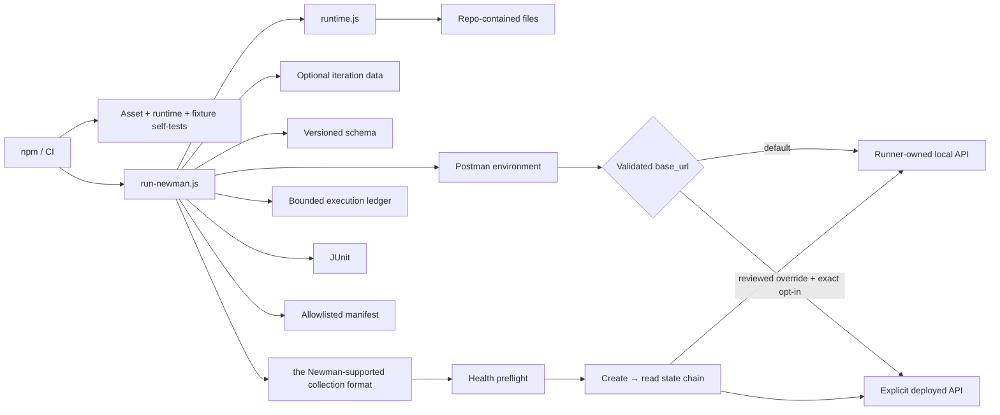

# Architecture

## Design objective

The framework keeps the Newman-supported Postman Collection format assets portable while the Node launcher supplies execution governance. Collection scripts own request and assertion semantics; Node code owns input provenance, target validation and authorization, deterministic local-target lifecycle, schema injection, timeout/correlation policy, bounded execution evidence, and process-exit integrity.



The launcher must not become a second API test implementation. It configures Newman, owns deterministic process lifecycle and authorization boundaries, and records execution state; endpoint behavior remains in the collection.

## File provenance boundary

Collection, environment, schema, and iteration-data paths are resolved relative to the repository root. `projectFile()` rejects traversal or absolute resolution outside that root.

This keeps CI execution inputs reviewable and prevents process-environment overrides from silently reading arbitrary runner files.

## Target configuration, authorization, and classification

The selected Postman environment must contain **exactly one enabled** `base_url`. Zero enabled entries are ambiguous/missing ownership; duplicate enabled entries make precedence ambiguous. Both conditions fail before Newman execution.

The committed default is `http://127.0.0.1:4010`. `NEWMAN_BASE_URL` can propose an override without rewriting the environment file, but the resolved target always passes through `targetPolicy()` before lifecycle or request side effects. `targetPolicy()` applies URL validation and the external-authorization decision together so callers cannot classify a target through one path and authorize it through another.

The target must be absolute HTTP(S), include a hostname, reject explicit port `0`, and contain no user-info, query, or fragment.

A non-local target is **fail-closed**. It is rejected unless `NEWMAN_ALLOW_EXTERNAL_TARGET` is the exact literal `true`. Values such as `TRUE`, `1`, `yes`, whitespace-padded strings, unset, empty, or `false` do not authorize external traffic. Supplying exact `true` while the target is still the local default does not disable or reclassify the owned fixture.

`TEST_RUN_ID` is independently normalized through a bounded correlation-token contract: 1–128 ASCII letters, digits, dots, underscores, colons, or hyphens. Invalid operator input fails before Newman executes requests. The environment may contain at most one enabled `run_id`; the runner updates it or adds one when absent, preventing duplicate enabled correlation identity.

`NEWMAN_FOLDER`, when supplied, is a bounded label with no control characters. It is normalized before it is passed to Newman and redacted/bounded again before persistence.

The runner classifies the effective target as:

- `local-fixture` when it equals the committed deterministic default; `externalTargetAuthorized` is always `false`;
- `explicit-external` only for a validated non-default target accompanied by exact external authorization; `externalTargetAuthorized` is `true`.

That classification and authorization bit are persisted in the run manifest so a deployed-environment failure is not confused with the deterministic framework gate and so evidence cannot imply external intent that the runtime never authorized.

## Deterministic local API lifecycle

`scripts/local-api.js` exposes `createLocalApiServer()`, `startLocalApi()`, and `stopLocalApi()` around a small Node HTTP fixture. The default protocol surface is intentionally narrow:

- `GET /health`;
- `GET /posts`;
- `GET /posts/:id`;
- `POST /posts`;
- JSON content type;
- request-ID echo;
- explicit 400/404 responses.

The fixture retains created synthetic posts so the collection can prove a real state transition: create a resource, capture its generated identifier, then read that same representation back.

When the effective target is the default local URL, `run-newman.js` starts the fixture before Newman and closes it in `finally`. Server start resolves only after the listener is accepting connections; required CI therefore needs no shell background process, fixed sleep, or separate curl polling loop.

Only an **authorized** explicit external target suppresses local fixture startup. A non-local URL without exact authorization is rejected before Newman is invoked.

Fixture startup and shutdown are part of correctness. A lifecycle failure remains nonzero and cannot be hidden by reporter completion.

## Independent fixture contract

`scripts/local-api.selftest.js` binds the fixture on an ephemeral port and validates health, list, item lookup, create semantics, stateful reread, and request-ID propagation using native `fetch`.

It runs during `npm run validate`, before Newman. This separates fixture regressions from collection/runtime regressions and ensures local protocol code can be verified without public network access.

## Collection workflow and variable ownership

Collection-level scripts own universal policy such as request/run correlation and common protocol assertions. Endpoint scripts own endpoint status, semantic values, and schema expectations.

The collection begins with an explicit health preflight before it exercises stateful resources. A create request stores temporary collection variables for the created identifier/title, and the following read request consumes those values to prove the representation can be retrieved through the public API contract.

Temporary state is scoped to the collection run and is cleaned rather than treated as permanent environment configuration. Iteration data explicitly takes precedence over environment values for data-driven identifiers.

Exact folder selection remains an execution option for focused troubleshooting, but the full required gate owns the complete collection workflow.

The runner does not duplicate endpoint assertions. The same collection remains executable through normal Postman/Newman semantics.

## Schema ownership

JSON Schemas are stored under `schemas/` as ordinary reviewable files. The runner loads the schema and injects it as a Newman global so the collection does not carry a duplicated embedded copy.

Schema validation supplements semantic assertions. Shape alone cannot prove requested-ID equality or write representation correctness.

## Runtime validation

`npm run validate` combines independent contracts:

1. `validate-assets.js` — committed collection/environment integrity and secret-like value guards;
2. `runtime.selftest.js` — path containment, timeout, target URL/hostname/port, exact external authorization, target classification, correlation-token, optional-label, and diagnostic-redaction policy;
3. `local-api.selftest.js` — executable loopback API behavior and lifecycle;
4. execution-ledger/evidence self-tests — bounded request evidence and retained-evidence invariants.

The runtime self-test proves the authorization policy without making external requests: absent/false authorization rejects a non-local target, exact `true` accepts it, malformed lookalikes fail, and local execution remains local even if the opt-in variable is present.

Node-side policy should fail before Newman sends collection requests.

## Newman execution and exit semantics

`run-newman.js` wraps Newman callback execution in a Promise to make the lifecycle explicit:

```text
validate inputs
    ↓
resolve target + authorization + run correlation + focused selector
    ↓
start local fixture if owned
    ↓
execute Newman + record bounded request observations
    ↓
write allowlisted manifest
    ↓
close owned fixture
    ↓
preserve final nonzero status when any stage failed
```

Newman assertion/runtime failures remain authoritative. Evidence generation or cleanup cannot convert a failing run into success.

## Execution ledger

`scripts/execution-ledger.js` observes Newman's `request` events and retains only structural fields needed for attribution:

- iteration and request position;
- HTTP method;
- sanitized path without credentials/query/fragment;
- response status;
- response time;
- transport error class when present.

The ledger is bounded to 5,000 entries and discards oldest observations when full. It never stores request/response bodies, authorization values, cookies, raw query strings, or arbitrary exception objects.

The ledger is embedded in the allowlisted run manifest so request-level evidence remains useful without serializing Newman's broad internal execution graph.

## Evidence model

Default machine-readable output remains intentionally narrow:

```text
reports/
├── newman-junit.xml
└── run-manifest.json
```

The run manifest is **constructed from explicit allowlists** rather than copying Newman's broad `summary.run` objects. It contains:

- schema version and validated run ID;
- repository-relative input paths;
- optional bounded/redacted folder selector;
- validated base URL, target class, and `externalTargetAuthorized` boolean;
- request timeout;
- selected Newman counters for iterations/items/requests/tests/assertions (`total`, `pending`, `failed` only);
- selected timings: normalized start/completion ISO timestamps, derived duration, response average/min/max/standard deviation;
- bounded execution-ledger entries;
- bounded/redacted failure identity.

`validate-evidence.js` independently checks the target evidence before accepting artifacts. `local-fixture` must pair the exact loopback URL with `externalTargetAuthorized=false`; `explicit-external` must pair a non-local URL with `externalTargetAuthorized=true`. Unknown target classes are rejected. Required `posts-full` profiles additionally require `local-fixture`, so normal CI evidence cannot be relabeled as an external integration run.

Counter values must be non-negative integers or become `null`; timing metrics must be finite and non-negative or become `null`; invalid dates do not survive as raw third-party values. Newly introduced fields inside future Newman summaries are therefore discarded unless deliberately reviewed and added to this evidence contract.

The manifest is written to a temporary path and atomically renamed.

## Why raw Newman JSON is not retained by default

A raw third-party execution summary can contain substantially more nested runtime state than CI needs. Safely redacting an arbitrary deep structure is harder to reason about than constructing a narrow allowlist.

JUnit integrates with CI test surfaces; the manifest contains operational attribution. Broader raw evidence should require an explicit reviewed need and access/redaction policy.

## Diagnostic privacy

`runtime.js` redacts URL user-info/query/fragment, fails closed for malformed HTTP(S) diagnostic URLs, redacts bearer/basic credential values, common secret/token/password/API-key assignments, and oversized failure text.

The external authorization decision never needs credentials and error text does not echo a rejected target URL. Authorization is an explicit execution-intent bit, not a secret transport mechanism.

This applies to structured/log evidence. It does not make arbitrary request or response payloads safe to retain. Collection logging and test data must remain controlled.

## Collection-format and runtime compatibility

This repository intentionally targets **the Newman-supported Postman Collection format executed by Newman**. That is an explicit runtime contract, not an accidental old file format.

Newman does not provide the Postman a newer collection format execution path used by newer Postman platform workflows. If a requirement needs a newer collection format or newer Postman-native Git/CLI behavior, migration means changing the execution engine to Postman CLI, updating asset format and CI semantics, and revalidating evidence/privacy contracts. It should not be performed as a casual JSON-version edit while retaining Newman.

## Primary and extended gates

Both primary and extended collection execution use the runner-owned default local API. The difference is scope:

- primary — standard collection environment;
- extended — full data-driven execution using `data/posts.json`.

Target determinism is not deferred to extended CI. Required workflows do not set `NEWMAN_ALLOW_EXTERNAL_TARGET=true` and therefore cannot silently become external framework-health checks.

## External integration model

A deployed run requires two deliberate inputs in the same invocation: a reviewed non-local `NEWMAN_BASE_URL` and exact `NEWMAN_ALLOW_EXTERNAL_TARGET=true`. The same collection/assertions run, but evidence identifies the target as `explicit-external` and records that the explicit authorization boundary was satisfied.

The authorization bit proves operator intent to cross the deterministic local boundary; it does **not** prove the target is trusted, healthy, production-safe, or appropriately credentialed. Target review, credentials, data controls, and environment ownership remain operational responsibilities outside this repository contract.

External DNS, TLS, deployment state, data, or downstream availability are then distinct failure domains rather than prerequisites for required framework CI.

## Parallelism and port ownership

The default fixture uses loopback port `4010`. One `run-newman.js` process owns that port for its execution. Independent GitHub Actions jobs run on separate runners.

If multiple local Newman processes are intentionally executed on the same host, they must use isolated target/port ownership rather than silently competing for the same listener.

## CI boundary

Primary CI executes asset/runtime/fixture validation and then the collection against the runner-owned API. Extended CI adds iteration data. Workflows retain read-only repository permissions, duplicate-run cancellation, bounded runtimes, run correlation, and focused evidence. Trivy runs independently for vulnerability, misconfiguration, and committed-secret findings.

Required CI sets an expected `local-fixture` evidence class and validates it after execution. This is separate from the runtime authorization check: both must agree for required evidence to pass.

## Extension rules

New runner behavior should:

1. validate every new filesystem input against the repository root;
2. validate target/runtime/correlation/selector policy before lifecycle or Newman side effects;
3. require an explicit independently testable authorization signal before any new external side effect;
4. reject ambiguous duplicate enabled environment identity values;
5. keep request/assertion semantics in Postman assets;
6. keep required target lifecycle deterministic and repository-owned;
7. add zero-public-network tests for new fixture/runtime policy;
8. construct evidence from explicit field allowlists rather than serializing broad runtime objects;
9. normalize/bound/redact retained values before persistence;
10. preserve Newman, reporter, authorization, and lifecycle failure status;
11. keep the Newman-supported collection format/Newman compatibility boundary explicit;
12. classify explicit deployed-environment execution separately from required CI and validate that classification in retained evidence.
