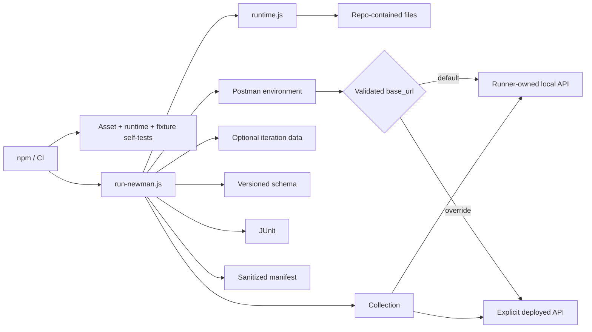

# Architecture

## Design objective

The framework keeps Postman assets portable while the Node launcher supplies execution governance. Collection scripts own request and assertion semantics; Node code owns input provenance, target validation, deterministic local-target lifecycle, schema injection, timeout policy, evidence construction, and process-exit integrity.



The launcher must not become a second API test implementation. It configures Newman, owns deterministic process lifecycle, and records execution state; endpoint behavior remains in the collection.

## File provenance boundary

Collection, environment, schema, and iteration-data paths are resolved relative to the repository root. `projectFile()` rejects traversal or absolute resolution outside that root.

This keeps CI execution inputs reviewable and prevents process-environment overrides from silently reading arbitrary runner files.

## Target configuration and classification

The selected Postman environment contains an enabled `base_url`. The committed default is `http://127.0.0.1:4010`. `NEWMAN_BASE_URL` can override that value without rewriting the environment file, but the resolved target always passes through `absoluteHttpBaseUrl()` before lifecycle or request side effects.

The target must be absolute HTTP(S), include a hostname, and contain no user-info, query, or fragment.

The runner classifies the effective target as:

- `local-fixture` when it equals the committed deterministic default;
- `explicit-external` for a validated non-default override.

That classification is persisted in the run manifest so a deployed-environment failure is not confused with the deterministic framework gate.

## Deterministic local API lifecycle

`scripts/local-api.js` exposes `createLocalApiServer()`, `startLocalApi()`, and `stopLocalApi()` around a small Node HTTP fixture. The default protocol surface is intentionally narrow:

- `GET /health`;
- `GET /posts`;
- `GET /posts/:id`;
- `POST /posts`;
- JSON content type;
- request-ID echo;
- explicit 400/404 responses.

When the effective target is the default local URL, `run-newman.js` starts the fixture before Newman and closes it in `finally`. Server start resolves only after the listener is accepting connections; required CI therefore needs no shell background process, fixed sleep, or separate curl polling loop.

If an explicit external target is selected, the runner does not start the local API.

Fixture startup and shutdown are part of correctness. A lifecycle failure remains nonzero and cannot be hidden by reporter completion.

## Independent fixture contract

`scripts/local-api.selftest.js` binds the fixture on an ephemeral port and validates health, list, item lookup, create semantics, and request-ID propagation using native `fetch`.

It runs during `npm run validate`, before Newman. This separates fixture regressions from collection/runtime regressions and ensures local protocol code can be verified without public network access.

## Collection and variable ownership

Collection-level scripts own universal policy such as request/run correlation and common protocol assertions. Endpoint scripts own endpoint status, semantic values, and schema expectations.

Generated per-request values use local/request scope unless a later request intentionally consumes them. Iteration data explicitly takes precedence over environment values for data-driven identifiers.

The runner does not duplicate endpoint assertions. The same collection remains executable through normal Postman/Newman semantics.

## Schema ownership

JSON Schemas are stored under `schemas/` as ordinary reviewable files. The runner loads the schema and injects it as a Newman global so the collection does not carry a duplicated embedded copy.

Schema validation supplements semantic assertions. Shape alone cannot prove requested-ID equality or write representation correctness.

## Runtime validation

`npm run validate` combines three independent contracts:

1. `validate-assets.js` — committed collection/environment integrity and secret-like value guards;
2. `runtime.selftest.js` — path containment, timeout, target URL, and diagnostic redaction policy;
3. `local-api.selftest.js` — executable loopback API behavior and lifecycle.

Node-side policy should fail before Newman sends collection requests.

## Newman execution and exit semantics

`run-newman.js` wraps Newman callback execution in a Promise to make the lifecycle explicit:

```text
validate inputs
    ↓
resolve target
    ↓
start local fixture if owned
    ↓
execute Newman
    ↓
write allowlisted manifest
    ↓
close owned fixture
    ↓
preserve final nonzero status when any stage failed
```

Newman assertion/runtime failures remain authoritative. Evidence generation or cleanup cannot convert a failing run into success.

## Evidence model

Default machine-readable output remains intentionally narrow:

```text
reports/
├── newman-junit.xml
└── run-manifest.json
```

The run manifest contains an allowlisted set of fields:

- schema version and run ID;
- relative input paths;
- optional folder;
- validated base URL;
- target class;
- request timeout;
- Newman stats/timings;
- bounded/redacted failure identity.

It is written to a temporary path and atomically renamed.

## Why raw Newman JSON is not retained by default

A raw third-party execution summary can contain substantially more nested runtime state than CI needs. Safely redacting an arbitrary deep structure is harder to reason about than constructing a narrow allowlist.

JUnit integrates with CI test surfaces; the manifest contains operational attribution. Broader raw evidence should require an explicit reviewed need and access/redaction policy.

## Diagnostic privacy

`runtime.js` redacts URL user-info/query/fragment, bearer/basic credential values, common secret/token/password/API-key assignments, and oversized failure text.

This applies to structured/log evidence. It does not make arbitrary request or response payloads safe to retain. Collection logging and test data must remain controlled.

## Primary and extended gates

Both primary and extended collection execution use the runner-owned default local API. The difference is scope:

- primary — standard collection environment;
- extended — full data-driven execution using `data/posts.json`.

Target determinism is not deferred to extended CI.

## External integration model

A validated `NEWMAN_BASE_URL` override intentionally selects a deployed API. The same collection/assertions run, but evidence identifies the target as `explicit-external`.

External DNS, TLS, deployment state, data, or downstream availability are then distinct failure domains rather than prerequisites for required framework CI.

## Parallelism and port ownership

The default fixture uses loopback port `4010`. One `run-newman.js` process owns that port for its execution. Independent GitHub Actions jobs run on separate runners.

If multiple local Newman processes are intentionally executed on the same host, they must use isolated target/port ownership rather than silently competing for the same listener.

## CI boundary

Primary CI executes asset/runtime/fixture validation and then the collection against the runner-owned API. Extended CI adds iteration data. Workflows retain read-only repository permissions, duplicate-run cancellation, bounded runtimes, run correlation, and focused evidence.

## Extension rules

New runner behavior should:

1. validate every new filesystem input against the repository root;
2. validate target/runtime policy before lifecycle or Newman side effects;
3. keep request/assertion semantics in Postman assets;
4. keep required target lifecycle deterministic and repository-owned;
5. add zero-public-network tests for new fixture/runtime policy;
6. construct evidence from an allowlist rather than serializing broad runtime objects;
7. bound/redact text before persistence;
8. preserve Newman, reporter, and lifecycle failure status;
9. classify explicit deployed-environment execution separately from required CI.
