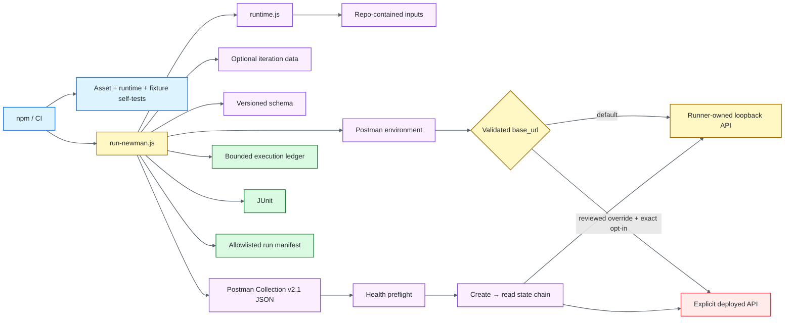

# Architecture

## Design objective

The framework keeps Postman request/assertion semantics portable while the Node launcher supplies execution governance. Collection assets own API behavior. Node code owns input provenance, target validation and authorization, deterministic local-target lifecycle, schema injection, timeout/correlation policy, bounded execution evidence, and process-exit integrity.



The launcher must not become a second API test implementation. It configures Newman, owns process lifecycle and authorization boundaries, and records execution state; endpoint behavior remains in the collection.

## Ownership model

| Surface | Owner |
| --- | --- |
| Request definitions and endpoint assertions | Postman collection |
| Shared response schemas | `schemas/` |
| Environment and iteration values | Postman/Newman variable scopes |
| Temporary create→read state | Collection variables with explicit cleanup |
| File provenance, URL, timeout, correlation, authorization | Node runtime |
| Deterministic HTTP behavior | Runner-owned Node fixture |
| CI-native test result | Newman JUnit reporter |
| Request-level attribution | Bounded execution ledger |
| Run-level attribution | Allowlisted manifest |

## File provenance boundary

Collection, environment, schema, and iteration-data paths are resolved relative to the repository root. Runtime overrides that escape the project root are rejected before Newman executes.

This keeps execution inputs reviewable and prevents environment variables from silently reading arbitrary runner files.

## Target policy

The committed default is `http://127.0.0.1:4010`. Exactly one enabled `base_url` must exist in the selected Postman environment; zero or duplicate enabled values fail closed because target ownership would be ambiguous.

The resolved target passes through one policy boundary before lifecycle or request side effects. It must be absolute HTTP(S), include a hostname, reject explicit port `0`, and contain no user-info, query, or fragment.

A non-local target is rejected unless `NEWMAN_ALLOW_EXTERNAL_TARGET` is the exact `true` literal. Values such as `TRUE`, `1`, `yes`, whitespace-padded strings, empty strings, unset values, and `false` do not authorize external traffic.

The runner persists both target classification and intent evidence:

- `local-fixture` → committed loopback target with `externalTargetAuthorized=false`;
- `explicit-external` → validated non-local target with `externalTargetAuthorized=true`.

Supplying `NEWMAN_ALLOW_EXTERNAL_TARGET=true` while using the default loopback target does not reclassify or disable the owned fixture.

`TEST_RUN_ID` and optional `NEWMAN_FOLDER` are bounded correlation/selection values rather than arbitrary payload carriers. Invalid control characters or unsafe lengths fail before Newman execution.

## Deterministic local API lifecycle

`scripts/local-api.js` owns the repository-local HTTP fixture. Its intentional surface is narrow:

- `GET /health`;
- `GET /posts`;
- `GET /posts/:id`;
- `POST /posts`;
- JSON content type;
- request-ID echo;
- deterministic create/read state;
- explicit error responses.

When the effective target is the default local URL, `run-newman.js` starts the fixture before Newman and closes it in `finally`. Server start resolves only after the listener is ready. Required CI therefore needs no public API, shell background process, fixed sleep, or separate polling loop.

Only an authorized explicit external target suppresses local fixture startup. Fixture start/stop failures remain execution failures.

## Independent fixture contract

`scripts/local-api.selftest.js` binds the fixture on an ephemeral port and validates health, list, item lookup, create semantics, stateful reread, and request-ID propagation using native `fetch`.

It runs during `npm run validate`, before Newman. This distinguishes fixture regressions from collection/runtime regressions without requiring public network access.

## Collection workflow

Collection-level scripts own universal policy such as run/request correlation, shared content-type expectations, and response-time budgets. Endpoint scripts own endpoint status, semantic values, schema expectations, and state handoff.

The full collection begins with a health preflight. A create request stores temporary collection variables for the generated identifier/title, and the following read consumes those values to prove state continuity before removing them.

Iteration data intentionally takes precedence over environment fallback where supplied. Temporary state remains scoped to the workflow that needs it.

## Schema ownership

JSON Schemas live under `schemas/` and are injected once by the runner. The collection therefore uses a version-controlled schema source without carrying duplicated embedded copies.

Schema checks supplement semantic assertions; shape alone does not prove requested-ID equality or write-representation correctness.

## Runtime validation

`npm run validate` combines independent contracts:

1. committed collection/environment asset integrity and secret-like-value guards;
2. repository-path, timeout, target, authorization, correlation, selector, and redaction policy;
3. executable local-fixture protocol/lifecycle checks;
4. execution-ledger and evidence self-tests.

The external-target authorization contract is tested without sending external traffic.

## Newman lifecycle and exit semantics

```text
validate inputs
    ↓
resolve target + authorization + run correlation + optional folder
    ↓
start owned local fixture when applicable
    ↓
execute Newman + record bounded request observations
    ↓
write allowlisted manifest
    ↓
close owned fixture
    ↓
preserve nonzero status when any stage failed
```

Newman assertion/runtime failure remains authoritative. Reporting or cleanup cannot convert a failed execution into success.

## Execution ledger

`scripts/execution-ledger.js` observes Newman request events and retains only structural fields needed for attribution:

- iteration and request position;
- normalized HTTP method;
- sanitized pathname without query/fragment;
- response status;
- response time;
- transport error class.

The ledger is bounded. It excludes bodies, authorization values, cookies, raw query strings, and arbitrary exception objects.

## Evidence model

Default machine-readable output is intentionally narrow:

```text
reports/
├── newman-junit.xml
└── run-manifest.json
```

The manifest is constructed from explicit allowlists rather than serializing Newman's broad execution graph. It contains validated identity/provenance, target class and authorization evidence, selected counters/timings, the bounded execution ledger, and bounded/redacted failure identity.

Required CI independently reconciles target evidence. A `local-fixture` run must use the exact loopback URL with `externalTargetAuthorized=false`; an `explicit-external` run must use a non-local URL with `externalTargetAuthorized=true`.

Raw Newman JSON is not retained by default because its broad runtime state can exceed the evidence needed for diagnosis.

## Compatibility boundary

This repository intentionally uses **Newman** with **Postman Collection v2.1 JSON**. A move to Collection v3 / YAML is not a file-format-only edit: it requires a Postman CLI migration plus requalification of lifecycle, target authorization, variable behavior, reporting, evidence, and exit-integrity contracts.

## CI boundary

Primary and extended CI use the same deterministic local target. Extended execution adds iteration-data breadth rather than a different reliability model.

Required workflows do not authorize external targets. Security and documentation remain separate failure domains so repository risk or docs drift does not masquerade as API assertion flakiness.

## Parallelism and port ownership

One runner process owns loopback port `4010` for its execution. GitHub Actions jobs run on isolated runners. Multiple local Newman processes on the same host require explicit isolated port/target ownership instead of racing for the committed default.

## Extension rules

New runner behavior should:

1. validate every filesystem input against repository root;
2. validate target/runtime/correlation/selector policy before side effects;
3. require a separately testable authorization signal before any new external side effect;
4. reject ambiguous duplicate enabled environment identity values;
5. keep request/assertion semantics in Postman assets;
6. keep required target lifecycle deterministic and repository-owned;
7. add zero-public-network tests for new fixture/runtime policy;
8. construct evidence from explicit allowlists;
9. normalize, bound, and redact retained values before persistence;
10. preserve Newman, authorization, reporter, and lifecycle failure status;
11. keep the Newman/Postman Collection compatibility boundary explicit;
12. classify deployed-environment execution separately from required CI.
