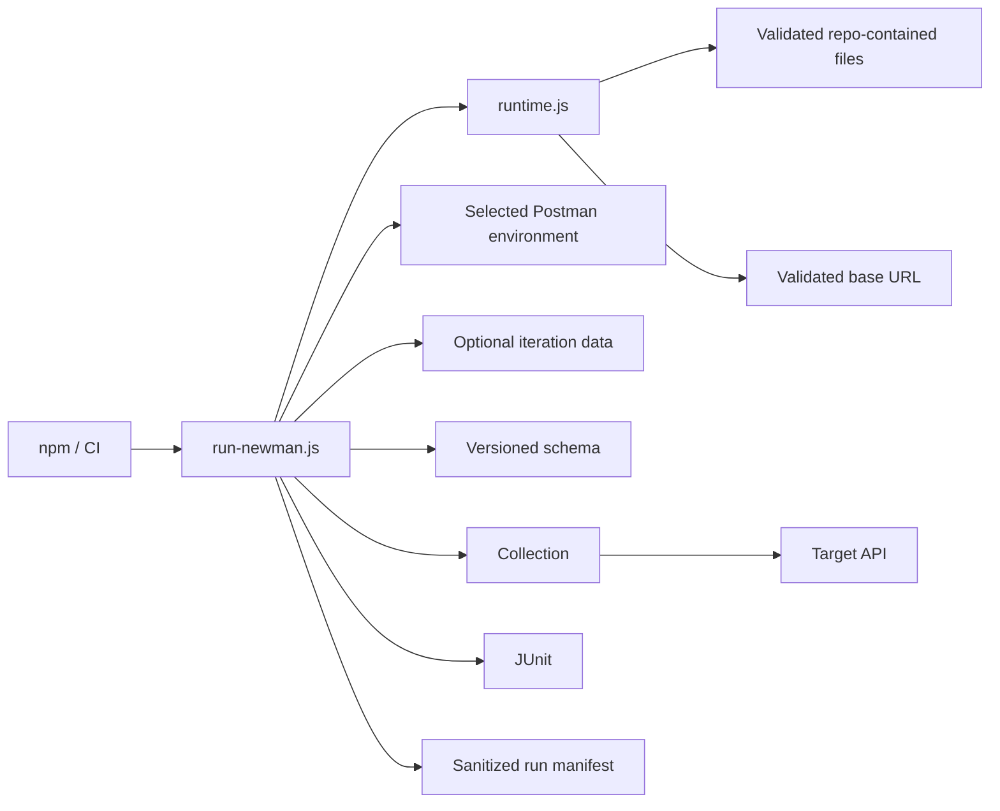

# Architecture

## Design objective

The framework keeps Postman assets portable while the Node launcher supplies execution governance. Collection scripts own request/assertion semantics; Node code owns input provenance, target validation, schema injection, timeout policy, reporting, and process exit behavior.



The launcher must not become a second API test implementation. It configures Newman and records execution state; endpoint behavior remains in the collection.

## File provenance boundary

Collection, environment, schema, and iteration-data paths are resolved relative to the repository root. `projectFile()` rejects traversal or absolute resolution outside that root.

This makes CI execution inputs reviewable and prevents process-environment overrides from silently reading arbitrary runner files.

## Target configuration

The selected Postman environment must contain an enabled `base_url`. `NEWMAN_BASE_URL` can override that value without rewriting the environment file, but the resolved target always passes through `absoluteHttpBaseUrl()` before Newman starts.

The target must be:

- absolute HTTP(S);
- free of URL user-info/credentials;
- free of query strings and fragments;
- allowed to include a path prefix.

Credentials belong in controlled headers/cookies/environment values injected at runtime, not in the URL authority.

## Collection and variable ownership

Collection-level scripts own only universal policy such as request/run correlation and common protocol assertions. Endpoint scripts own endpoint status, semantic values, and schema expectations.

Generated per-request values should use local/request scope unless a later request intentionally consumes them. Avoid turning the environment into mutable shared scratch state.

## Schema ownership

JSON Schemas are stored under `schemas/` as ordinary reviewable files. The runner loads the schema and injects it as a Newman global so collection JSON does not contain a duplicated embedded copy.

Schema validation supplements semantic assertions. Shape alone cannot prove requested-ID equality or business behavior.

## Runtime validation

`runtime.selftest.js` verifies launcher policy without network access:

- positive timeout parsing;
- repository-contained path resolution;
- path-escape rejection;
- HTTP(S) target validation;
- rejection of URL credentials/query/fragment;
- diagnostic URL sanitization;
- bounded/redacted failure compaction.

This test runs during `npm run validate` before Newman sends requests.

## Evidence model

Default machine-readable output is intentionally narrow:

```text
reports/
├── newman-junit.xml
└── run-manifest.json
```

The run manifest is built from an allowlisted set of fields:

- schema version/run ID;
- exact relative input paths;
- selected folder;
- validated resolved target;
- request-timeout policy;
- Newman stats/timings;
- bounded/redacted failure identity.

The manifest is written to a temporary path and atomically renamed.

## Why raw Newman JSON is not retained by default

A raw third-party execution summary can contain substantially more nested runtime state than the framework actually needs for CI triage. Safely redacting an arbitrary deep structure is harder to reason about than constructing a narrow allowlisted manifest.

Therefore the JSON reporter is not enabled by default. JUnit integrates with CI test UIs, while the run manifest contains the operational context needed for attribution. Deeper raw output should be an explicit policy decision with restricted artifact access and a reviewed redaction strategy.

## Diagnostic privacy

`runtime.js` redacts:

- URL user-info/query/fragment;
- bearer/basic credential values;
- common token/password/secret/API-key assignments;
- oversized failure labels/messages.

Top-level Newman startup errors are also reduced through the same text redaction helper before logging.

This protects structured/log evidence; it does not make arbitrary request/response payloads safe to retain. Test data and collection logging policy still require discipline.

## Exit semantics

The Node runner preserves Newman failures as nonzero process status. A report is evidence, not a reason to convert a failing suite into a successful CI job.

Launcher/runtime validation errors also fail before test execution rather than being hidden inside collection assertions.

## Extension rules

New runner behavior should:

1. validate every new filesystem input against the repository root;
2. validate target/runtime policy before Newman starts;
3. leave request/assertion semantics in Postman assets;
4. add zero-network self-tests for Node-side policy;
5. construct evidence from an allowlist rather than serializing broad runtime objects;
6. bound/redact text before persistence;
7. preserve Newman exit semantics;
8. keep schemas and iteration data version-controlled and reviewable.
